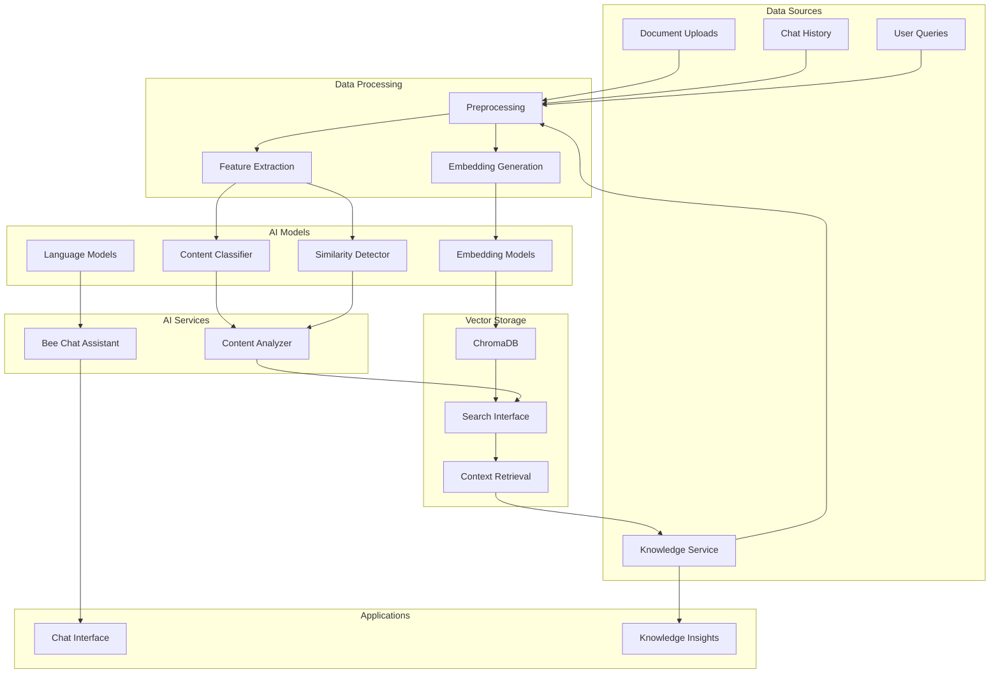

# STING-CE AI/ML Architecture

## Overview
STING-CE implements a comprehensive AI/ML architecture that combines local language models, vector databases, and machine learning pipelines to provide intelligent threat analysis, conversational AI, and automated security insights.

## AI/ML System Overview



## Local AI Infrastructure

### 1. Model Architecture

#### Language Models
```python
# Supported LLM Models
SUPPORTED_MODELS = {
    "phi3": {
        "name": "microsoft/Phi-3-mini-4k-instruct",
        "type": "instruct",
        "context_length": 4096,
        "memory_requirement": "4GB",
        "quantization": "8-bit",
        "use_case": "General chat, code assistance",
        "performance": "fast"
    },
    "deepseek": {
        "name": "deepseek-ai/deepseek-coder-1.3b-instruct",
        "type": "code",
        "context_length": 4096,
        "memory_requirement": "2GB",
        "quantization": "8-bit",
        "use_case": "Code analysis, technical queries",
        "performance": "very_fast"
    },
    "zephyr": {
        "name": "HuggingFaceH4/zephyr-7b-beta",
        "type": "chat",
        "context_length": 8192,
        "memory_requirement": "8GB",
        "quantization": "4-bit",
        "use_case": "Advanced reasoning, analysis",
        "performance": "medium"
    },
    "llama3": {
        "name": "meta-llama/Llama-3.2-3B-Instruct",
        "type": "instruct",
        "context_length": 8192,
        "memory_requirement": "6GB",
        "quantization": "4-bit",
        "use_case": "General purpose, reasoning",
        "performance": "medium"
    }
}
```

#### Embedding Models
```python
# Embedding Model Configuration
EMBEDDING_MODELS = {
    "general": {
        "model": "sentence-transformers/all-MiniLM-L6-v2",
        "dimensions": 384,
        "max_tokens": 256,
        "use_case": "General text similarity",
        "performance": "fast"
    },
    "security": {
        "model": "sentence-transformers/all-mpnet-base-v2",
        "dimensions": 768,
        "max_tokens": 384,
        "use_case": "Security content analysis",
        "performance": "medium"
    },
    "code": {
        "model": "microsoft/codebert-base",
        "dimensions": 768,
        "max_tokens": 512,
        "use_case": "Code similarity, analysis",
        "performance": "medium"
    }
}
```

### 2. Model Loading and Management

```python
class ModelManager:
    def __init__(self):
        self.models = {}
        self.config = load_model_config()
        
    def load_model(self, model_name: str) -> torch.nn.Module:
        """Load model with optimal configuration"""
        if model_name in self.models:
            return self.models[model_name]
            
        config = SUPPORTED_MODELS[model_name]
        
        # Configure quantization
        quantization_config = BitsAndBytesConfig(
            load_in_8bit=config["quantization"] == "8-bit",
            load_in_4bit=config["quantization"] == "4-bit",
            bnb_4bit_compute_dtype=torch.float16
        )
        
        # Load model with optimization
        model = AutoModelForCausalLM.from_pretrained(
            config["name"],
            quantization_config=quantization_config,
            device_map="auto",
            torch_dtype=torch.float16,
            trust_remote_code=True
        )
        
        # Optimize for inference
        model.eval()
        if hasattr(model, 'compile'):
            model = torch.compile(model)
            
        self.models[model_name] = model
        return model
    
    def unload_model(self, model_name: str):
        """Free model memory"""
        if model_name in self.models:
            del self.models[model_name]
            torch.cuda.empty_cache()
            gc.collect()
```

## Vector Database Architecture

### 1. ChromaDB Integration

```python
class VectorDatabase:
    def __init__(self):
        self.client = chromadb.PersistentClient(
            path="/app/data/chroma"
        )
        self.collections = {}
        
    def create_collection(self, name: str, embedding_model: str):
        """Create optimized collection"""
        collection = self.client.create_collection(
            name=name,
            embedding_function=self._get_embedding_function(embedding_model),
            metadata={
                "hnsw:space": "cosine",
                "hnsw:construction_ef": 200,
                "hnsw:M": 16
            }
        )
        self.collections[name] = collection
        return collection
    
    def _get_embedding_function(self, model_name: str):
        """Get optimized embedding function"""
        config = EMBEDDING_MODELS[model_name]
        return SentenceTransformerEmbeddings(
            model_name=config["model"],
            model_kwargs={
                'device': 'cpu',  # Use CPU for embeddings
                'normalize_embeddings': True
            }
        )
```

### 2. Knowledge Collections

```python
# Collection Schemas
KNOWLEDGE_COLLECTIONS = {
    "honey_jar_documents": {
        "embedding_model": "general",
        "chunk_size": 512,
        "chunk_overlap": 50,
        "metadata_fields": [
            "honey_jar_id", "document_type", "file_type", 
            "timestamp", "author", "tags"
        ]
    },
    "knowledge_base": {
        "embedding_model": "general",
        "chunk_size": 256,
        "chunk_overlap": 25,
        "metadata_fields": [
            "category", "source", "relevance", 
            "honey_jar_id", "created_at", "tags"
        ]
    },
    "documentation": {
        "embedding_model": "general",
        "chunk_size": 1000,
        "chunk_overlap": 100,
        "metadata_fields": [
            "doc_type", "section", "version", 
            "category", "tags", "last_updated"
        ]
    },
    "conversation_history": {
        "embedding_model": "general",
        "chunk_size": 2000,
        "chunk_overlap": 200,
        "metadata_fields": [
            "user_id", "session_id", "timestamp",
            "intent", "context_used", "feedback"
        ]
    }
}
```

## AI Services Architecture

### 1. Bee Chat Assistant

```python
class BeeAssistant:
    def __init__(self):
        self.llm = ModelManager().load_model("phi3")
        self.tokenizer = AutoTokenizer.from_pretrained("microsoft/Phi-3-mini-4k-instruct")
        self.knowledge = KnowledgeService()
        self.context_manager = ContextManager()
        
    async def chat(self, query: str, context: dict = None) -> ChatResponse:
        """Main chat interface with context awareness"""
        
        # 1. Analyze user intent
        intent = await self._analyze_intent(query)
        
        # 2. Retrieve relevant context
        if intent.requires_knowledge:
            knowledge_context = await self.knowledge.search(
                query=query,
                top_k=5,
                filters=context
            )
        else:
            knowledge_context = []
            
        # 3. Build conversation context
        conversation_context = await self.context_manager.get_context(
            user_id=context.get("user_id"),
            session_id=context.get("session_id")
        )
        
        # 4. Generate response
        response = await self._generate_response(
            query=query,
            intent=intent,
            knowledge_context=knowledge_context,
            conversation_context=conversation_context
        )
        
        # 5. Update context and store interaction
        await self.context_manager.update_context(
            user_id=context.get("user_id"),
            session_id=context.get("session_id"),
            query=query,
            response=response,
            context_used=knowledge_context
        )
        
        return response
    
    async def _generate_response(self, query: str, intent: Intent, 
                               knowledge_context: list, 
                               conversation_context: list) -> ChatResponse:
        """Generate contextual response"""
        
        # Build prompt with context
        prompt = self._build_prompt(
            query=query,
            intent=intent,
            knowledge_context=knowledge_context,
            conversation_context=conversation_context
        )
        
        # Generate with streaming support
        if intent.stream_response:
            return await self._generate_streaming(prompt)
        else:
            return await self._generate_static(prompt)
    
    def _build_prompt(self, query: str, intent: Intent, 
                     knowledge_context: list, 
                     conversation_context: list) -> str:
        """Build optimized prompt with context"""
        
        system_prompt = """You are Bee, an AI assistant specialized in cybersecurity and threat intelligence. 
        You help users analyze security events, manage honey jars, and understand threat landscapes.
        
        Key capabilities:
        - Analyze security events and threats
        - Explain honey jar configurations
        - Provide threat intelligence insights
        - Help with STING platform usage
        - Answer technical questions about cybersecurity.
        
        Guidelines:
        - Be concise but thorough
        - Use technical accuracy
        - Provide actionable insights
        - Reference source material when available
        - Ask clarifying questions when needed.
        """
        
        # Add knowledge context if available
        context_section = ""
        if knowledge_context:
            context_section = "\n\nRelevant Information:\n"
            for i, ctx in enumerate(knowledge_context, 1):
                context_section += f"{i}. {ctx['content'][:500]}...\n"
                context_section += f"   Source: {ctx['metadata'].get('source', 'Unknown')}\n"
        
        # Add conversation history
        history_section = ""
        if conversation_context:
            history_section = "\n\nConversation History:\n"
            for msg in conversation_context[-3:]:  # Last 3 exchanges
                history_section += f"User: {msg['query']}\n"
                history_section += f"Bee: {msg['response'][:200]}...\n"
        
        return f"{system_prompt}{context_section}{history_section}\n\nUser: {query}\nBee:"
```

### 2. Content Analysis Engine

```python
class ContentAnalyzer:
    def __init__(self):
        self.classifier = self._load_content_classifier()
        self.similarity_detector = self._load_similarity_detector()
        self.feature_extractor = FeatureExtractor()
        
    async def analyze_document(self, document: Document) -> ContentAnalysis:
        """Comprehensive content analysis"""
        
        # 1. Extract features
        features = self.feature_extractor.extract(document)
        
        # 2. Classify content type
        content_classification = await self._classify_content(features)
        
        # 3. Detect similar content
        similarity_score = await self._detect_similarity(features)
        
        # 4. Get contextual knowledge
        knowledge_context = await self._get_knowledge_context(document)
        
        # 5. Calculate relevance score
        relevance_score = self._calculate_relevance_score(
            content_classification,
            similarity_score,
            knowledge_context
        )
        
        # 6. Generate categorization
        categorization = await self._generate_categorization(
            document, content_classification, relevance_score
        )
        
        return ContentAnalysis(
            document_id=document.id,
            content_type=content_classification.content_type,
            confidence=content_classification.confidence,
            similarity_score=similarity_score,
            relevance_score=relevance_score,
            categories=categorization,
            keywords=knowledge_context,
            analysis_timestamp=datetime.utcnow()
        )
    
    def _load_content_classifier(self):
        """Load pre-trained content classification model"""
        return joblib.load("/app/models/content_classifier.pkl")
    
    def _load_similarity_detector(self):
        """Load similarity detection model"""
        return joblib.load("/app/models/similarity_detector.pkl")
```

### 3. Knowledge Service

```python
class KnowledgeService:
    def __init__(self):
        self.vector_db = VectorDatabase()
        self.document_processor = DocumentProcessor()
        self.search_engine = SemanticSearch()
        
    async def ingest_document(self, document: Document, 
                            honey_jar_id: str) -> IngestionResult:
        """Process and store document with embeddings"""
        
        # 1. Extract text content
        text_content = await self.document_processor.process(document)
        
        # 2. Chunk document
        chunks = self.document_processor.chunk_text(
            text=text_content,
            chunk_size=1000,
            chunk_overlap=100
        )
        
        # 3. Generate embeddings
        embeddings = []
        for chunk in chunks:
            embedding = await self._generate_embedding(chunk.text)
            embeddings.append(embedding)
        
        # 4. Store in vector database
        collection = self.vector_db.get_collection("documentation")
        
        ids = [f"{document.id}_{i}" for i in range(len(chunks))]
        metadatas = [
            {
                "honey_jar_id": honey_jar_id,
                "document_id": document.id,
                "chunk_index": i,
                "doc_type": document.type,
                "title": document.title,
                "created_at": document.created_at.isoformat()
            }
            for i, chunk in enumerate(chunks)
        ]
        
        collection.add(
            ids=ids,
            embeddings=embeddings,
            documents=[chunk.text for chunk in chunks],
            metadatas=metadatas
        )
        
        return IngestionResult(
            document_id=document.id,
            chunks_created=len(chunks),
            status="success"
        )
    
    async def search(self, query: str, top_k: int = 5, 
                    filters: dict = None) -> list[SearchResult]:
        """Semantic search across knowledge base"""
        
        # Generate query embedding
        query_embedding = await self._generate_embedding(query)
        
        # Build filter conditions
        where_conditions = {}
        if filters:
            if filters.get("honey_jar_id"):
                where_conditions["honey_jar_id"] = filters["honey_jar_id"]
            if filters.get("doc_type"):
                where_conditions["doc_type"] = filters["doc_type"]
        
        # Search vector database
        collection = self.vector_db.get_collection("documentation")
        results = collection.query(
            query_embeddings=[query_embedding],
            n_results=top_k,
            where=where_conditions if where_conditions else None
        )
        
        # Format results
        search_results = []
        for i in range(len(results["ids"][0])):
            search_results.append(SearchResult(
                content=results["documents"][0][i],
                score=1 - results["distances"][0][i],  # Convert distance to similarity
                metadata=results["metadatas"][0][i]
            ))
        
        return search_results
```

## Machine Learning Pipeline

### 1. Training Pipeline

```python
class MLPipeline:
    def __init__(self):
        self.feature_store = FeatureStore()
        self.model_registry = ModelRegistry()
        
    async def train_threat_classifier(self):
        """Train threat classification model"""
        
        # 1. Prepare training data
        training_data = await self._prepare_training_data()
        
        # 2. Feature engineering
        features, labels = self._engineer_features(training_data)
        
        # 3. Split data
        X_train, X_test, y_train, y_test = train_test_split(
            features, labels, test_size=0.2, stratify=labels
        )
        
        # 4. Train model
        model = RandomForestClassifier(
            n_estimators=100,
            max_depth=10,
            random_state=42
        )
        model.fit(X_train, y_train)
        
        # 5. Evaluate model
        predictions = model.predict(X_test)
        accuracy = accuracy_score(y_test, predictions)
        
        # 6. Save model if performance is good
        if accuracy > 0.85:
            self.model_registry.save_model(
                model=model,
                name="threat_classifier",
                version=datetime.now().strftime("%Y%m%d_%H%M%S"),
                metrics={"accuracy": accuracy}
            )
        
        return {"accuracy": accuracy, "model_saved": accuracy > 0.85}
    
    async def train_anomaly_detector(self):
        """Train anomaly detection model"""
        
        # 1. Get normal behavior data
        normal_data = await self._get_normal_behavior_data()
        
        # 2. Feature extraction
        features = self._extract_anomaly_features(normal_data)
        
        # 3. Train isolation forest
        model = IsolationForest(
            contamination=0.1,
            random_state=42,
            n_estimators=100
        )
        model.fit(features)
        
        # 4. Validate on known anomalies
        validation_score = await self._validate_anomaly_model(model)
        
        # 5. Save model
        if validation_score > 0.8:
            self.model_registry.save_model(
                model=model,
                name="anomaly_detector",
                version=datetime.now().strftime("%Y%m%d_%H%M%S"),
                metrics={"validation_score": validation_score}
            )
        
        return {"validation_score": validation_score}
```

### 2. Feature Engineering

```python
class FeatureExtractor:
    def extract(self, event: SecurityEvent) -> np.ndarray:
        """Extract ML features from security event"""
        
        features = []
        
        # Temporal features
        features.extend(self._extract_temporal_features(event))
        
        # Network features
        features.extend(self._extract_network_features(event))
        
        # Payload features
        features.extend(self._extract_payload_features(event))
        
        # Behavioral features
        features.extend(self._extract_behavioral_features(event))
        
        return np.array(features)
    
    def _extract_temporal_features(self, event: SecurityEvent) -> list:
        """Extract time-based features"""
        timestamp = event.created_at
        
        return [
            timestamp.hour,
            timestamp.day_of_week,
            timestamp.is_weekend,
            self._time_since_last_event(event.honey jar_id)
        ]
    
    def _extract_network_features(self, event: SecurityEvent) -> list:
        """Extract network-based features"""
        return [
            self._ip_to_int(event.source_ip),
            event.source_port or 0,
            event.destination_port or 0,
            self._is_private_ip(event.source_ip),
            self._get_geolocation_risk(event.source_ip)
        ]
    
    def _extract_payload_features(self, event: SecurityEvent) -> list:
        """Extract payload-based features"""
        payload = event.payload or {}
        
        return [
            len(str(payload)),
            self._contains_suspicious_strings(payload),
            self._entropy_score(str(payload)),
            self._command_injection_score(payload)
        ]
```

## Model Optimization

### 1. Quantization and Compression

```python
class ModelOptimizer:
    def optimize_for_inference(self, model: torch.nn.Module) -> torch.nn.Module:
        """Optimize model for production inference"""
        
        # 1. Quantization
        quantized_model = torch.quantization.quantize_dynamic(
            model, 
            {torch.nn.Linear}, 
            dtype=torch.qint8
        )
        
        # 2. Pruning (if applicable)
        if hasattr(model, 'prune'):
            pruned_model = self._prune_model(quantized_model)
        else:
            pruned_model = quantized_model
        
        # 3. Compilation
        if torch.cuda.is_available():
            compiled_model = torch.compile(pruned_model)
        else:
            compiled_model = pruned_model
        
        return compiled_model
    
    def _prune_model(self, model: torch.nn.Module, sparsity: float = 0.2):
        """Prune model weights"""
        import torch.nn.utils.prune as prune
        
        for module in model.modules():
            if isinstance(module, torch.nn.Linear):
                prune.l1_unstructured(module, name='weight', amount=sparsity)
        
        return model
```

### 2. Caching and Performance

```python
class InferenceCache:
    def __init__(self):
        self.cache = TTLCache(maxsize=1000, ttl=3600)  # 1 hour TTL
        
    async def get_or_compute(self, cache_key: str, 
                           compute_func: Callable, 
                           *args, **kwargs):
        """Get cached result or compute new one"""
        
        if cache_key in self.cache:
            return self.cache[cache_key]
        
        result = await compute_func(*args, **kwargs)
        self.cache[cache_key] = result
        
        return result
    
    def invalidate_pattern(self, pattern: str):
        """Invalidate cache entries matching pattern"""
        keys_to_remove = [
            key for key in self.cache.keys() 
            if fnmatch.fnmatch(key, pattern)
        ]
        
        for key in keys_to_remove:
            del self.cache[key]
```

## AI/ML Monitoring

### 1. Model Performance Monitoring

```python
class MLMonitor:
    def __init__(self):
        self.metrics_collector = MetricsCollector()
        
    def track_inference(self, model_name: str, input_data: any, 
                       output: any, latency: float):
        """Track model inference metrics"""
        
        self.metrics_collector.record_histogram(
            "ml_inference_latency",
            latency,
            tags={"model": model_name}
        )
        
        self.metrics_collector.increment(
            "ml_inference_count",
            tags={"model": model_name}
        )
        
        # Track input/output characteristics
        if hasattr(input_data, '__len__'):
            self.metrics_collector.record_histogram(
                "ml_input_size",
                len(input_data),
                tags={"model": model_name}
            )
    
    def track_model_drift(self, model_name: str, predictions: list):
        """Monitor for model drift"""
        
        # Calculate prediction distribution
        pred_distribution = self._calculate_distribution(predictions)
        
        # Compare with baseline
        baseline = self._get_baseline_distribution(model_name)
        drift_score = self._calculate_drift_score(pred_distribution, baseline)
        
        # Alert if drift detected
        if drift_score > 0.1:
            self._alert_model_drift(model_name, drift_score)
        
        return drift_score
```

### 2. AI Ethics and Fairness

```python
class AIEthicsMonitor:
    def __init__(self):
        self.bias_detector = BiasDetector()
        
    def evaluate_fairness(self, model: torch.nn.Module, 
                         test_data: Dataset) -> FairnessReport:
        """Evaluate model fairness across protected attributes"""
        
        # Test for bias across different groups
        bias_metrics = {}
        
        for attribute in ["source_country", "honey jar_type"]:
            if attribute in test_data.columns:
                bias_score = self.bias_detector.measure_bias(
                    model, test_data, protected_attribute=attribute
                )
                bias_metrics[attribute] = bias_score
        
        return FairnessReport(
            model_name=model.__class__.__name__,
            bias_metrics=bias_metrics,
            overall_fairness_score=np.mean(list(bias_metrics.values())),
            recommendations=self._generate_fairness_recommendations(bias_metrics)
        )
```

---

*This AI/ML architecture ensures STING-CE leverages cutting-edge AI capabilities while maintaining privacy, performance, and ethical standards for cybersecurity applications.*