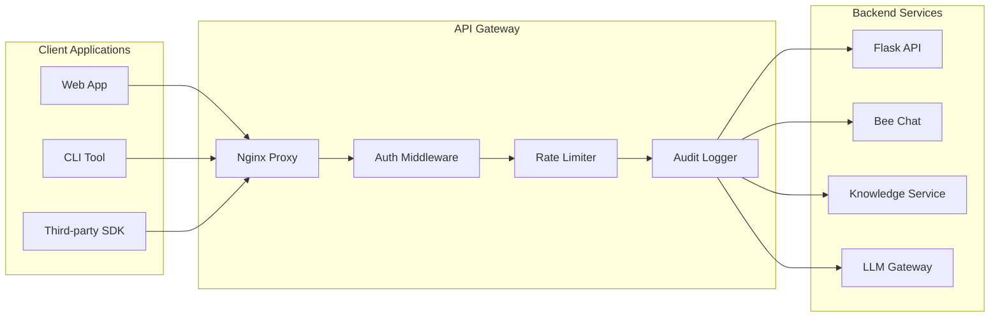

# STING-CE API Architecture

## Overview
STING-CE implements a RESTful API architecture with OpenAPI specification, following industry standards for security, versioning, and documentation. The API serves as the primary interface between the frontend and backend services.

## API Design Principles

### 1. RESTful Design
- Resource-based URLs.
- HTTP methods for actions (GET, POST, PUT, DELETE).
- Stateless operations.
- Consistent response formats.

### 2. Security First
- All endpoints require authentication.
- Role-based authorization.
- Rate limiting.
- Input validation.

### 3. Developer Experience
- Self-documenting with OpenAPI/Swagger.
- Consistent error responses.
- Comprehensive examples.
- SDK generation support.

## API Gateway Architecture



## API Structure

### 1. Base Configuration

```yaml
openapi: 3.0.3
info:
  title: STING-CE API
  version: 1.0.0
  description: Secure Threat Intelligence Network Guardian API
  contact:
    name: STING-CE Support
    url: https://sting-ce.com/support
  license:
    name: MIT
    url: https://opensource.org/licenses/MIT

servers:
  - url: https://localhost:5050/api/v1
    description: Local development
  - url: https://api.sting-ce.com/v1
    description: Production

security:
  - BearerAuth: []
  - ApiKeyAuth: []
```

### 2. Authentication Schemes

```yaml
components:
  securitySchemes:
    BearerAuth:
      type: http
      scheme: bearer
      bearerFormat: JWT
      description: Kratos session token
      
    ApiKeyAuth:
      type: apiKey
      in: header
      name: X-API-Key
      description: API key for programmatic access
      
    PasskeyAuth:
      type: http
      scheme: bearer
      description: WebAuthn passkey authentication
```

## Core API Endpoints

### 1. Authentication & User Management

```yaml
paths:
  /auth/login:
    post:
      summary: Authenticate user
      tags: [Authentication]
      requestBody:
        required: true
        content:
          application/json:
            schema:
              type: object
              properties:
                email:
                  type: string
                  format: email
                password:
                  type: string
                  minLength: 8
                remember_me:
                  type: boolean
                  default: false
      responses:
        200:
          description: Authentication successful
          content:
            application/json:
              schema:
                $ref: '#/components/schemas/AuthResponse'
        401:
          $ref: '#/components/responses/Unauthorized'
        429:
          $ref: '#/components/responses/RateLimited'

  /auth/passkey/challenge:
    post:
      summary: Get WebAuthn challenge for passkey
      tags: [Authentication]
      requestBody:
        required: true
        content:
          application/json:
            schema:
              type: object
              properties:
                email:
                  type: string
                  format: email
      responses:
        200:
          description: Challenge generated
          content:
            application/json:
              schema:
                type: object
                properties:
                  challenge:
                    type: string
                  timeout:
                    type: integer
                  rpId:
                    type: string

  /users/profile:
    get:
      summary: Get current user profile
      tags: [Users]
      responses:
        200:
          description: User profile
          content:
            application/json:
              schema:
                $ref: '#/components/schemas/User'
    
    put:
      summary: Update user profile
      tags: [Users]
      requestBody:
        required: true
        content:
          application/json:
            schema:
              $ref: '#/components/schemas/UserUpdate'
      responses:
        200:
          description: Profile updated
          content:
            application/json:
              schema:
                $ref: '#/components/schemas/User'
```

### 2. Honey Jar Management (Knowledge Bases)

```yaml
  /honey-pots:
    get:
      summary: List honey pots (knowledge bases)
      tags: [Knowledge Management]
      parameters:
        - name: page
          in: query
          schema:
            type: integer
            minimum: 1
            default: 1
        - name: limit
          in: query
          schema:
            type: integer
            minimum: 1
            maximum: 100
            default: 20
        - name: status
          in: query
          schema:
            type: string
            enum: [active, inactive, processing]
        - name: type
          in: query
          schema:
            type: string
            enum: [public, private, premium, marketplace]
      responses:
        200:
          description: List of honey pots
          content:
            application/json:
              schema:
                type: object
                properties:
                  honey_jars:
                    type: array
                    items:
                      $ref: '#/components/schemas/HoneyJar'
                  pagination:
                    $ref: '#/components/schemas/Pagination'

    post:
      summary: Create new honey pot (knowledge base)
      tags: [Knowledge Management]
      requestBody:
        required: true
        content:
          application/json:
            schema:
              $ref: '#/components/schemas/HoneyJarCreate'
      responses:
        201:
          description: Honey pot created
          content:
            application/json:
              schema:
                $ref: '#/components/schemas/HoneyJar'

  /honey-pots/{id}:
    get:
      summary: Get honey pot details
      tags: [Knowledge Management]
      parameters:
        - name: id
          in: path
          required: true
          schema:
            type: string
            format: uuid
      responses:
        200:
          description: Honey pot details
          content:
            application/json:
              schema:
                $ref: '#/components/schemas/HoneyJarDetail'

    put:
      summary: Update honey pot
      tags: [Knowledge Management]
      parameters:
        - name: id
          in: path
          required: true
          schema:
            type: string
            format: uuid
      requestBody:
        required: true
        content:
          application/json:
            schema:
              $ref: '#/components/schemas/HoneyJarUpdate'
      responses:
        200:
          description: Honey pot updated
          content:
            application/json:
              schema:
                $ref: '#/components/schemas/HoneyJar'

    delete:
      summary: Delete honey pot
      tags: [Knowledge Management]
      parameters:
        - name: id
          in: path
          required: true
          schema:
            type: string
            format: uuid
      responses:
        204:
          description: Honey pot deleted

  /honey-pots/{id}/documents:
    get:
      summary: List documents in honey pot
      tags: [Knowledge Management]
      parameters:
        - name: id
          in: path
          required: true
          schema:
            type: string
            format: uuid
      responses:
        200:
          description: Documents list
          content:
            application/json:
              schema:
                type: object
                properties:
                  documents:
                    type: array
                    items:
                      $ref: '#/components/schemas/Document'
                  pagination:
                    $ref: '#/components/schemas/Pagination'

    post:
      summary: Upload document to honey pot
      tags: [Knowledge Management]
      parameters:
        - name: id
          in: path
          required: true
          schema:
            type: string
            format: uuid
      requestBody:
        required: true
        content:
          multipart/form-data:
            schema:
              type: object
              properties:
                file:
                  type: string
                  format: binary
                metadata:
                  type: object
      responses:
        201:
          description: Document uploaded successfully
```

### 3. Document Management

```yaml
  /documents:
    get:
      summary: List documents across honey pots
      tags: [Documents]
      parameters:
        - name: honey_jar_id
          in: query
          schema:
            type: string
            format: uuid
        - name: file_type
          in: query
          schema:
            type: string
        - name: processing_status
          in: query
          schema:
            type: string
            enum: [pending, processing, completed, failed]
        - name: from
          in: query
          schema:
            type: string
            format: date-time
        - name: to
          in: query
          schema:
            type: string
            format: date-time
        - name: page
          in: query
          schema:
            type: integer
            minimum: 1
            default: 1
        - name: limit
          in: query
          schema:
            type: integer
            minimum: 1
            maximum: 100
            default: 20
      responses:
        200:
          description: List of events
          content:
            application/json:
              schema:
                type: object
                properties:
                  events:
                    type: array
                    items:
                      $ref: '#/components/schemas/Event'
                  pagination:
                    $ref: '#/components/schemas/Pagination'
                  summary:
                    type: object
                    properties:
                      total_events:
                        type: integer
                      unique_sources:
                        type: integer
                      avg_threat_level:
                        type: number

  /events/{id}:
    get:
      summary: Get event details
      tags: [Events]
      parameters:
        - name: id
          in: path
          required: true
          schema:
            type: string
            format: uuid
      responses:
        200:
          description: Event details
          content:
            application/json:
              schema:
                $ref: '#/components/schemas/EventDetail'

  /events/search:
    post:
      summary: Search events
      tags: [Events]
      requestBody:
        required: true
        content:
          application/json:
            schema:
              type: object
              properties:
                query:
                  type: string
                  description: Full-text search query
                filters:
                  type: object
                  properties:
                    threat_levels:
                      type: array
                      items:
                        type: integer
                    event_types:
                      type: array
                      items:
                        type: string
                    date_range:
                      type: object
                      properties:
                        start:
                          type: string
                          format: date-time
                        end:
                          type: string
                          format: date-time
      responses:
        200:
          description: Search results
          content:
            application/json:
              schema:
                type: object
                properties:
                  results:
                    type: array
                    items:
                      $ref: '#/components/schemas/Event'
                  total:
                    type: integer
                  query_time:
                    type: number
```

### 4. AI/Chat Integration

```yaml
  /chat:
    post:
      summary: Chat with Bee assistant
      tags: [AI]
      requestBody:
        required: true
        content:
          application/json:
            schema:
              type: object
              properties:
                message:
                  type: string
                  maxLength: 4000
                context:
                  type: object
                  properties:
                    honey jar_id:
                      type: string
                      format: uuid
                    event_id:
                      type: string
                      format: uuid
                stream:
                  type: boolean
                  default: false
      responses:
        200:
          description: Chat response
          content:
            application/json:
              schema:
                type: object
                properties:
                  response:
                    type: string
                  context_used:
                    type: array
                    items:
                      type: string
                  tokens_used:
                    type: integer
                  response_time:
                    type: number

  /knowledge/search:
    post:
      summary: Search knowledge base
      tags: [Knowledge]
      requestBody:
        required: true
        content:
          application/json:
            schema:
              type: object
              properties:
                query:
                  type: string
                  maxLength: 1000
                top_k:
                  type: integer
                  minimum: 1
                  maximum: 20
                  default: 5
                honey_jar_ids:
                  type: array
                  items:
                    type: string
                    format: uuid
      responses:
        200:
          description: Search results
          content:
            application/json:
              schema:
                type: object
                properties:
                  results:
                    type: array
                    items:
                      type: object
                      properties:
                        content:
                          type: string
                        score:
                          type: number
                        metadata:
                          type: object
                        honey_jar_name:
                          type: string
```

## Data Models

### 1. Core Schemas

```yaml
components:
  schemas:
    User:
      type: object
      properties:
        id:
          type: string
          format: uuid
        email:
          type: string
          format: email
        display_name:
          type: string
        role:
          type: string
          enum: [admin, analyst, viewer]
        created_at:
          type: string
          format: date-time
        last_login:
          type: string
          format: date-time
        is_active:
          type: boolean

    HoneyJar:
      type: object
      properties:
        id:
          type: string
          format: uuid
        name:
          type: string
          minLength: 3
          maxLength: 100
        type:
          type: string
          enum: [public, private, premium, marketplace]
        description:
          type: string
          maxLength: 500
        status:
          type: string
          enum: [active, inactive, processing]
        config:
          type: object
          description: Knowledge base configuration
        owner_id:
          type: string
          format: uuid
        created_at:
          type: string
          format: date-time
        updated_at:
          type: string
          format: date-time
        last_accessed:
          type: string
          format: date-time
        stats:
          type: object
          properties:
            total_documents:
              type: integer
            documents_today:
              type: integer
            total_chunks:
              type: integer
            avg_relevance_score:
              type: number

    Document:
      type: object
      properties:
        id:
          type: string
          format: uuid
        honey_jar_id:
          type: string
          format: uuid
        title:
          type: string
          maxLength: 500
        file_type:
          type: string
          enum: [pdf, docx, txt, md, html, json]
        file_size:
          type: integer
          description: File size in bytes
        content_hash:
          type: string
          description: SHA-256 hash of content
        upload_path:
          type: string
          description: Storage path
        metadata:
          type: object
          description: Document-specific metadata
        processing_status:
          type: string
          enum: [pending, processing, completed, failed]
        chunk_count:
          type: integer
          description: Number of text chunks created
        tags:
          type: array
          items:
            type: string
        created_at:
          type: string
          format: date-time
        processed_at:
          type: string
          format: date-time

    Alert:
      type: object
      properties:
        id:
          type: string
          format: uuid
        event_id:
          type: string
          format: uuid
        alert_type:
          type: string
        severity:
          type: string
          enum: [low, medium, high, critical]
        title:
          type: string
          maxLength: 500
        description:
          type: string
        status:
          type: string
          enum: [new, investigating, resolved, false_positive]
        assigned_to:
          type: string
          format: uuid
        created_at:
          type: string
          format: date-time
        resolved_at:
          type: string
          format: date-time
```

### 2. Request/Response Models

```yaml
    HoneyJarCreate:
      type: object
      required: [name, type, config]
      properties:
        name:
          type: string
          minLength: 3
          maxLength: 100
        type:
          type: string
          enum: [public, private, premium, marketplace]
        description:
          type: string
          maxLength: 500
        config:
          type: object
          description: Knowledge base configuration

    Pagination:
      type: object
      properties:
        page:
          type: integer
          minimum: 1
        limit:
          type: integer
          minimum: 1
          maximum: 100
        total:
          type: integer
        pages:
          type: integer
        has_next:
          type: boolean
        has_prev:
          type: boolean

    Error:
      type: object
      properties:
        error:
          type: object
          properties:
            code:
              type: string
              description: Machine-readable error code
            message:
              type: string
              description: Human-readable error message
            details:
              type: object
              description: Additional error context
            timestamp:
              type: string
              format: date-time
            request_id:
              type: string
              description: Unique request identifier
```

## Error Handling

### 1. Standard Error Responses

```yaml
components:
  responses:
    BadRequest:
      description: Invalid request
      content:
        application/json:
          schema:
            $ref: '#/components/schemas/Error'
          example:
            error:
              code: "INVALID_REQUEST"
              message: "The request is invalid"
              details:
                field: "email"
                reason: "Invalid email format"
              timestamp: "2024-01-01T12:00:00Z"
              request_id: "req_123456"

    Unauthorized:
      description: Authentication required
      content:
        application/json:
          schema:
            $ref: '#/components/schemas/Error'
          example:
            error:
              code: "UNAUTHORIZED"
              message: "Authentication required"
              timestamp: "2024-01-01T12:00:00Z"
              request_id: "req_123456"

    Forbidden:
      description: Insufficient permissions
      content:
        application/json:
          schema:
            $ref: '#/components/schemas/Error'
          example:
            error:
              code: "FORBIDDEN"
              message: "Insufficient permissions to access this resource"
              timestamp: "2024-01-01T12:00:00Z"
              request_id: "req_123456"

    NotFound:
      description: Resource not found
      content:
        application/json:
          schema:
            $ref: '#/components/schemas/Error'
          example:
            error:
              code: "NOT_FOUND"
              message: "The requested resource was not found"
              timestamp: "2024-01-01T12:00:00Z"
              request_id: "req_123456"

    RateLimited:
      description: Rate limit exceeded
      headers:
        X-RateLimit-Limit:
          schema:
            type: integer
          description: Request limit per hour
        X-RateLimit-Remaining:
          schema:
            type: integer
          description: Remaining requests in current window
        X-RateLimit-Reset:
          schema:
            type: integer
          description: Unix timestamp when rate limit resets
      content:
        application/json:
          schema:
            $ref: '#/components/schemas/Error'
          example:
            error:
              code: "RATE_LIMITED"
              message: "Rate limit exceeded. Try again later."
              timestamp: "2024-01-01T12:00:00Z"
              request_id: "req_123456"

    ValidationError:
      description: Validation failed
      content:
        application/json:
          schema:
            $ref: '#/components/schemas/Error'
          example:
            error:
              code: "VALIDATION_ERROR"
              message: "Request validation failed"
              details:
                fields:
                  - field: "email"
                    message: "Invalid email format"
                  - field: "password"
                    message: "Password must be at least 8 characters"
              timestamp: "2024-01-01T12:00:00Z"
              request_id: "req_123456"
```

## Rate Limiting

### 1. Rate Limit Configuration

```python
# Rate limiting rules
RATE_LIMITS = {
    "auth": {
        "login": "5/minute",
        "registration": "3/hour",
        "password_reset": "10/hour"
    },
    "api": {
        "general": "1000/hour",
        "search": "100/hour",
        "upload": "20/hour"
    },
    "chat": {
        "messages": "50/hour",
        "streaming": "10/hour"
    }
}
```

### 2. Implementation

```python
from flask_limiter import Limiter
from flask_limiter.util import get_remote_address

limiter = Limiter(
    app,
    key_func=lambda: get_current_user().id if get_current_user() else get_remote_address(),
    default_limits=["1000 per hour"]
)

@app.route('/api/v1/auth/login', methods=['POST'])
@limiter.limit("5 per minute")
def login():
    pass

@app.route('/api/v1/chat', methods=['POST'])
@limiter.limit("50 per hour")
def chat():
    pass
```

## Versioning Strategy

### 1. URL Versioning

```
https://api.sting-ce.com/v1/honey jars
https://api.sting-ce.com/v2/honey jars
```

### 2. Header Versioning (Alternative)

```http
GET /api/honey jars
Accept: application/vnd.sting.v2+json
```

### 3. Version Compatibility

```python
# Version compatibility matrix
API_VERSIONS = {
    "v1": {
        "supported": True,
        "deprecated": False,
        "sunset_date": None
    },
    "v2": {
        "supported": True,
        "deprecated": False,
        "sunset_date": None
    }
}
```

## API Testing

### 1. Testing Strategy

```python
# Automated API testing
class APITestSuite:
    def test_authentication_flow(self):
        # Test login, token refresh, logout
        pass
    
    def test_honey jar_crud(self):
        # Test create, read, update, delete
        pass
    
    def test_rate_limiting(self):
        # Test rate limit enforcement
        pass
    
    def test_error_handling(self):
        # Test all error scenarios
        pass
```

### 2. Contract Testing

```yaml
# OpenAPI contract tests
contract_tests:
  - path: /api/v1/honey jars
    method: GET
    expected_status: 200
    expected_schema: Honey JarList
    
  - path: /api/v1/honey jars
    method: POST
    request_body: Honey JarCreate
    expected_status: 201
    expected_schema: Honey Jar
```

## Documentation Generation

### 1. Swagger UI Integration

```python
from flask_swagger_ui import get_swaggerui_blueprint

SWAGGER_URL = '/api/docs'
API_URL = '/api/v1/openapi.json'

swaggerui_blueprint = get_swaggerui_blueprint(
    SWAGGER_URL,
    API_URL,
    config={
        'app_name': "STING-CE API"
    }
)

app.register_blueprint(swaggerui_blueprint)
```

### 2. SDK Generation

```bash
# Generate Python SDK
openapi-generator generate \
  -i openapi.yaml \
  -g python \
  -o ./sdks/python \
  --additional-properties=packageName=sting_ce_client

# Generate JavaScript SDK
openapi-generator generate \
  -i openapi.yaml \
  -g javascript \
  -o ./sdks/javascript \
  --additional-properties=projectName=sting-ce-client
```

---

*This API architecture ensures STING-CE provides a robust, secure, and developer-friendly interface for all client applications and integrations.*