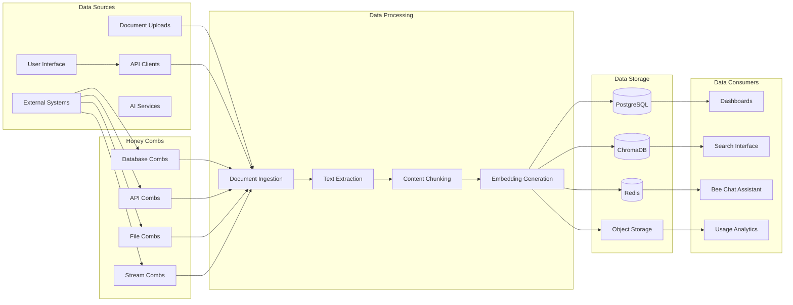

# STING-CE Data Architecture

## Overview
STING-CE implements a hybrid data architecture combining relational, document, vector, and cache storage to support diverse data requirements from structured threat intelligence to AI embeddings.

## Data Flow Overview



## Honey Combs - Data Source Configuration Layer

Honey Combs provide a configuration and abstraction layer for connecting to external data sources. They work with Worker Bees to enable rapid, secure data integration.

### Honey Comb Data Model

```sql
-- Honey Comb Templates
CREATE TABLE honey_combs (
    id UUID PRIMARY KEY DEFAULT gen_random_uuid(),
    name VARCHAR(255) NOT NULL,
    description TEXT,
    type VARCHAR(50) NOT NULL, -- 'database', 'api', 'file_system', 'stream'
    subtype VARCHAR(50) NOT NULL, -- 'postgresql', 'rest', 's3', 'kafka', etc.
    configuration JSONB NOT NULL, -- Encrypted connection config
    scrubbing_config JSONB, -- PII removal rules
    is_template BOOLEAN DEFAULT FALSE,
    is_public BOOLEAN DEFAULT FALSE,
    owner_id UUID REFERENCES users(id),
    created_at TIMESTAMP DEFAULT NOW(),
    updated_at TIMESTAMP DEFAULT NOW(),
    usage_count INTEGER DEFAULT 0,
    
    CONSTRAINT comb_types CHECK (type IN ('database', 'api', 'file_system', 'stream'))
);

-- Honey Comb Executions (Audit Trail)
CREATE TABLE honey_comb_executions (
    id UUID PRIMARY KEY DEFAULT gen_random_uuid(),
    comb_id UUID REFERENCES honey_combs(id),
    execution_type VARCHAR(50) NOT NULL, -- 'continuous_flow', 'snapshot_generation'
    target_honey_jar_id UUID REFERENCES honey_jars(id),
    started_at TIMESTAMP DEFAULT NOW(),
    completed_at TIMESTAMP,
    status VARCHAR(50) DEFAULT 'running',
    records_processed BIGINT DEFAULT 0,
    records_scrubbed BIGINT DEFAULT 0,
    error_message TEXT,
    metadata JSONB
);

-- Scrubbing Rules Library
CREATE TABLE scrubbing_profiles (
    id UUID PRIMARY KEY DEFAULT gen_random_uuid(),
    name VARCHAR(255) NOT NULL,
    description TEXT,
    compliance_standard VARCHAR(50), -- 'gdpr', 'ccpa', 'hipaa', etc.
    rules JSONB NOT NULL,
    is_system_default BOOLEAN DEFAULT FALSE,
    created_at TIMESTAMP DEFAULT NOW()
);
```

### Honey Comb Configuration Schema

```json
{
  "connection": {
    "vault_path": "/honey_combs/prod_db_creds",
    "parameters": {
      "host": "${COMB_DB_HOST}",
      "port": 5432,
      "database": "${COMB_DB_NAME}",
      "ssl_mode": "require"
    }
  },
  "extraction": {
    "mode": "incremental",
    "schedule": "*/5 * * * *",
    "query_template": "SELECT * FROM ${table} WHERE updated_at > ${last_sync}"
  },
  "scrubbing": {
    "enabled": true,
    "profile_id": "gdpr_compliant",
    "custom_rules": [
      {"field": "email", "action": "hash"},
      {"field": "ssn", "action": "remove"},
      {"pattern": "phone_*", "action": "mask"}
    ]
  },
  "output": {
    "format": "parquet",
    "compression": "snappy",
    "partitioning": ["year", "month"]
  }
}
```

### Data Flow with Honey Combs

1. **Configuration**: User selects or creates a Honey Comb template
2. **Authentication**: Worker Bee retrieves credentials from Vault
3. **Connection**: Establishes secure connection to data source
4. **Extraction**: Pulls data based on configured mode
5. **Scrubbing**: Applies privacy rules if enabled
6. **Transformation**: Converts to AI-ready format
7. **Storage**: Either streams to existing Honey Jar or creates new one

## Data Models

### 1. Relational Data (PostgreSQL)

#### Core Entities

```sql
-- Users and Authentication
CREATE TABLE users (
    id UUID PRIMARY KEY DEFAULT gen_random_uuid(),
    email VARCHAR(255) UNIQUE NOT NULL,
    display_name VARCHAR(255),
    role VARCHAR(50) NOT NULL DEFAULT 'viewer',
    created_at TIMESTAMP DEFAULT NOW(),
    updated_at TIMESTAMP DEFAULT NOW(),
    last_login TIMESTAMP,
    is_active BOOLEAN DEFAULT TRUE
);

-- Honey Jars (Knowledge Bases)
CREATE TABLE honey_jars (
    id UUID PRIMARY KEY DEFAULT gen_random_uuid(),
    name VARCHAR(255) NOT NULL,
    type VARCHAR(50) NOT NULL DEFAULT 'private',
    description TEXT,
    config JSONB NOT NULL,
    status VARCHAR(50) NOT NULL DEFAULT 'active',
    owner_id UUID REFERENCES users(id),
    created_at TIMESTAMP DEFAULT NOW(),
    updated_at TIMESTAMP DEFAULT NOW(),
    last_accessed TIMESTAMP,
    document_count INTEGER DEFAULT 0,
    
    CONSTRAINT honey_jar_types CHECK (type IN ('public', 'private', 'premium', 'marketplace'))
);

-- Documents
CREATE TABLE documents (
    id UUID PRIMARY KEY DEFAULT gen_random_uuid(),
    honey_jar_id UUID REFERENCES honey_jars(id) ON DELETE CASCADE,
    title VARCHAR(500) NOT NULL,
    file_type VARCHAR(50) NOT NULL,
    file_size BIGINT,
    content_hash VARCHAR(64),
    upload_path TEXT,
    metadata JSONB,
    processing_status VARCHAR(50) DEFAULT 'pending',
    chunk_count INTEGER DEFAULT 0,
    tags TEXT[],
    created_at TIMESTAMP DEFAULT NOW(),
    processed_at TIMESTAMP,
    
    CONSTRAINT processing_status_values CHECK (processing_status IN ('pending', 'processing', 'completed', 'failed'))
);

-- Threat Intelligence
CREATE TABLE threat_intel (
    id UUID PRIMARY KEY DEFAULT gen_random_uuid(),
    ioc_type VARCHAR(50) NOT NULL,
    ioc_value TEXT NOT NULL,
    threat_type VARCHAR(100),
    confidence FLOAT,
    source VARCHAR(255),
    first_seen TIMESTAMP DEFAULT NOW(),
    last_seen TIMESTAMP DEFAULT NOW(),
    metadata JSONB,
    
    UNIQUE(ioc_type, ioc_value)
);

-- Alerts
CREATE TABLE alerts (
    id UUID PRIMARY KEY DEFAULT gen_random_uuid(),
    event_id UUID REFERENCES events(id),
    alert_type VARCHAR(100) NOT NULL,
    severity VARCHAR(20) NOT NULL,
    title VARCHAR(500) NOT NULL,
    description TEXT,
    status VARCHAR(50) DEFAULT 'new',
    assigned_to UUID REFERENCES users(id),
    created_at TIMESTAMP DEFAULT NOW(),
    resolved_at TIMESTAMP,
    
    CONSTRAINT severity_values CHECK (severity IN ('low', 'medium', 'high', 'critical'))
);
```

#### Indexes for Performance

```sql
-- Document query optimization
CREATE INDEX idx_docs_honey_jar_time ON documents(honey_jar_id, created_at DESC);
CREATE INDEX idx_docs_file_type ON documents(file_type);
CREATE INDEX idx_docs_processing_status ON documents(processing_status) WHERE processing_status = 'pending';
CREATE INDEX idx_docs_processed ON documents(processed_at) WHERE processed_at IS NOT NULL;

-- GIN index for JSONB queries
CREATE INDEX idx_docs_metadata ON documents USING GIN (metadata);
CREATE INDEX idx_honey_jar_config ON honey_jars USING GIN (config);

-- Full text search
CREATE INDEX idx_docs_title_search ON documents USING GIN (to_tsvector('english', title));
```

### 2. Vector Data (ChromaDB)

#### Collections Schema

```python
# Document Embeddings Collection
document_embeddings = {
    "name": "honey_jar_documents",
    "embedding_function": embeddings.SentenceTransformerEmbeddings(
        model_name="all-MiniLM-L6-v2"
    ),
    "metadata": {
        "honey_jar_id": "string",
        "document_type": "string", 
        "file_type": "string",
        "timestamp": "int",
        "chunk_index": "int"
    }
}

# Knowledge Base Embeddings
knowledge_embeddings = {
    "name": "knowledge_base",
    "embedding_function": embeddings.SentenceTransformerEmbeddings(
        model_name="all-mpnet-base-v2"
    ),
    "metadata": {
        "category": "string",
        "source": "string",
        "relevance": "float",
        "honey_jar_id": "string",
        "tags": "list[string]"
    }
}

# Documentation Embeddings
doc_embeddings = {
    "name": "documentation",
    "embedding_function": embeddings.OpenAIEmbeddings(),
    "metadata": {
        "doc_type": "string",
        "section": "string",
        "version": "string",
        "tags": "list[string]",
        "last_updated": "int"
    }
}
```

### 3. Cache Data (Redis)

#### Key Patterns

```python
# Session Management
session:{user_id}:{session_id} = {
    "user_id": "uuid",
    "role": "string",
    "permissions": ["list"],
    "expires_at": "timestamp"
}

# Rate Limiting
rate_limit:{ip}:{endpoint} = counter
rate_limit:{user_id}:{action} = counter

# Real-time Statistics
stats:honeyjar:{id}:hourly = {
    "event_count": int,
    "unique_sources": int,
    "threat_levels": {level: count}
}

# AI Response Cache
ai:response:{query_hash} = {
    "response": "string",
    "context": ["list"],
    "timestamp": "int"
}

# Temporary Processing
queue:events:pending = ["event_ids"]
queue:alerts:high_priority = ["alert_ids"]
```

### 4. Object Storage (S3-Compatible)

#### Bucket Structure

```yaml
buckets:
  honeyjar-logs:
    structure:
      - /{year}/{month}/{day}/{honeyjar_id}/{hour}.log.gz
    retention: 90 days
    
  event-payloads:
    structure:
      - /raw/{year}/{month}/{day}/{event_id}.json
      - /processed/{year}/{month}/{day}/{event_id}.json
    retention: 180 days
    
  threat-intel:
    structure:
      - /feeds/{source}/{date}/intel.json
      - /reports/{year}/{month}/report_{id}.pdf
    retention: indefinite
    
  ai-models:
    structure:
      - /models/{model_name}/{version}/
      - /checkpoints/{model_name}/{timestamp}/
    versioning: enabled
    
  user-files:
    structure:
      - /profiles/{user_id}/avatar.{ext}
      - /documents/{user_id}/{file_id}.{ext}
      - /reports/{year}/{month}/{report_id}.pdf
    retention: user-controlled
    encryption: enabled
```

### 5. File Asset Management (Vault + MinIO Hybrid)

#### File Storage Architecture

```sql
-- File metadata table
CREATE TABLE file_assets (
    id UUID PRIMARY KEY DEFAULT gen_random_uuid(),
    filename VARCHAR(255) NOT NULL,
    original_filename VARCHAR(255) NOT NULL,
    file_type VARCHAR(50) NOT NULL,
    file_size BIGINT NOT NULL,
    mime_type VARCHAR(100),
    storage_backend VARCHAR(20) NOT NULL, -- 'vault', 'minio', 'filesystem'
    storage_path TEXT NOT NULL,
    owner_id UUID REFERENCES users(id),
    access_level VARCHAR(20) DEFAULT 'private',
    metadata JSONB,
    created_at TIMESTAMP DEFAULT NOW(),
    updated_at TIMESTAMP DEFAULT NOW(),
    deleted_at TIMESTAMP NULL
);

-- File permissions table
CREATE TABLE file_permissions (
    id UUID PRIMARY KEY DEFAULT gen_random_uuid(),
    file_id UUID REFERENCES file_assets(id),
    user_id UUID REFERENCES users(id),
    permission_type VARCHAR(20) NOT NULL, -- 'read', 'write', 'delete'
    granted_by UUID REFERENCES users(id),
    granted_at TIMESTAMP DEFAULT NOW(),
    expires_at TIMESTAMP NULL
);
```

#### Storage Backend Selection

| File Type | Storage Backend | Security Level | Use Case |
|-----------|----------------|----------------|----------|
| Profile Pictures | Vault | High | User avatars, personal images |
| User Documents | Vault | High | Private files, certificates |
| System Reports | MinIO | Medium | Generated reports, logs |
| Static Assets | Filesystem | Low | UI assets, templates |

## Data Pipeline Architecture

### 1. Ingestion Pipeline

```python
# Real-time Event Processing
class EventIngestionPipeline:
    def __init__(self):
        self.validator = EventValidator()
        self.enricher = EventEnricher()
        self.analyzer = ThreatAnalyzer()
        
    async def process_event(self, raw_event: dict) -> Event:
        # Step 1: Validation
        validated = await self.validator.validate(raw_event)
        
        # Step 2: Enrichment
        enriched = await self.enricher.enrich(validated)
        
        # Step 3: Threat Analysis
        analyzed = await self.analyzer.analyze(enriched)
        
        # Step 4: Storage
        await self.store_event(analyzed)
        
        # Step 5: Real-time alerting
        if analyzed.threat_level > ALERT_THRESHOLD:
            await self.trigger_alert(analyzed)
        
        return analyzed
```

### 2. ETL Pipeline

```yaml
etl_jobs:
  hourly_aggregation:
    schedule: "0 * * * *"
    tasks:
      - aggregate_event_statistics
      - update_threat_scores
      - refresh_materialized_views
      
  daily_intelligence:
    schedule: "0 2 * * *"
    tasks:
      - import_threat_feeds
      - correlate_events
      - generate_daily_report
      
  weekly_ml_training:
    schedule: "0 3 * * 0"
    tasks:
      - prepare_training_data
      - train_anomaly_detector
      - update_threat_classifier
```

## Data Governance

### 1. Data Classification

```yaml
data_classification:
  public:
    - honeyjar_types
    - documentation
    - api_specs
    
  internal:
    - aggregated_statistics
    - threat_trends
    - system_metrics
    
  confidential:
    - user_data
    - raw_events
    - threat_intelligence
    
  restricted:
    - authentication_tokens
    - encryption_keys
    - api_credentials
```

### 2. Data Retention

```python
# Retention Policies
retention_policies = {
    "events": {
        "hot": "7 days",      # Redis + PostgreSQL
        "warm": "90 days",    # PostgreSQL only
        "cold": "1 year",     # S3 archive
        "delete": "2 years"   # Permanent deletion
    },
    "user_data": {
        "active": "indefinite",
        "inactive": "90 days after last login",
        "deleted": "30 days soft delete"
    },
    "ai_embeddings": {
        "current": "30 days",
        "archive": "6 months"
    }
}
```

### 3. Data Privacy

```python
# PII Handling
class PIIHandler:
    def anonymize_ip(self, ip: str) -> str:
        """Anonymize IP address for privacy"""
        parts = ip.split('.')
        if len(parts) == 4:
            parts[3] = '0'
        return '.'.join(parts)
    
    def hash_identifier(self, identifier: str) -> str:
        """One-way hash for identifiers"""
        return hashlib.sha256(
            identifier.encode() + self.salt
        ).hexdigest()
    
    def redact_payload(self, payload: dict) -> dict:
        """Remove sensitive data from payloads"""
        sensitive_keys = ['password', 'token', 'key', 'secret']
        return {
            k: '***REDACTED***' if any(s in k.lower() for s in sensitive_keys) else v
            for k, v in payload.items()
        }
```

## Performance Optimization

### 1. Query Optimization

```sql
-- Partitioning for large tables
CREATE TABLE events_2024_01 PARTITION OF events
    FOR VALUES FROM ('2024-01-01') TO ('2024-02-01');

-- Materialized views for dashboards
CREATE MATERIALIZED VIEW hourly_stats AS
SELECT 
    date_trunc('hour', created_at) as hour,
    honeyjar_id,
    COUNT(*) as event_count,
    COUNT(DISTINCT source_ip) as unique_sources,
    AVG(threat_level) as avg_threat_level
FROM events
WHERE created_at > NOW() - INTERVAL '7 days'
GROUP BY 1, 2;

-- Refresh strategy
REFRESH MATERIALIZED VIEW CONCURRENTLY hourly_stats;
```

### 2. Caching Strategy

```python
# Multi-tier caching
cache_strategy = {
    "L1_memory": {
        "size": "512MB",
        "ttl": 60,
        "items": ["hot_queries", "user_sessions"]
    },
    "L2_redis": {
        "size": "4GB", 
        "ttl": 3600,
        "items": ["api_responses", "statistics", "ai_results"]
    },
    "L3_database": {
        "size": "unlimited",
        "ttl": 86400,
        "items": ["historical_data", "reports"]
    }
}
```

## Backup and Recovery

### 1. Backup Strategy

```yaml
backup_schedule:
  postgresql:
    full: "daily at 2 AM"
    incremental: "every 6 hours"
    retention: "30 days"
    
  chromadb:
    snapshot: "daily at 3 AM"
    retention: "14 days"
    
  redis:
    snapshot: "every hour"
    retention: "24 hours"
    
  s3:
    cross_region_replication: enabled
    versioning: enabled
```

### 2. Disaster Recovery

```python
# Recovery Time Objectives
rto_rpo = {
    "critical_data": {
        "rto": "1 hour",
        "rpo": "15 minutes"
    },
    "standard_data": {
        "rto": "4 hours",
        "rpo": "1 hour"
    },
    "archive_data": {
        "rto": "24 hours",
        "rpo": "24 hours"
    }
}
```

---

*This data architecture ensures STING-CE can handle high-volume threat data while maintaining performance, privacy, and reliability.*