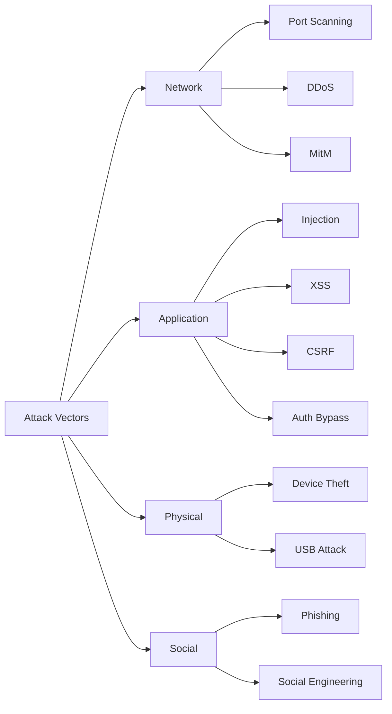

# STING-CE Security Architecture

## Overview
STING-CE implements defense-in-depth security principles with a zero-trust architecture. This document outlines the security controls, threat model, and compliance considerations.

## Security Principles

### Core Tenets
1. **Zero Trust**: Never trust, always verify
2. **Least Privilege**: Minimal access by default
3. **Defense in Depth**: Multiple security layers
4. **Security by Design**: Built-in, not bolted-on
5. **Transparency**: Open source security

## Threat Model

### Assets to Protect
```yaml
high_value_assets:
  - honey_jar_knowledge_bases
  - proprietary_documents
  - user_credentials
  - api_keys_and_tokens
  - ai_models_and_weights
  - system_configurations

medium_value_assets:
  - usage_analytics
  - search_logs
  - user_preferences
  - cached_data

low_value_assets:
  - public_documentation
  - ui_assets
  - demo_knowledge_bases
```

### Threat Actors
1. **External Attackers**: Attempting to access unauthorized knowledge bases
2. **Insider Threats**: Malicious users with valid access
3. **Supply Chain**: Compromised dependencies
4. **Data Thieves**: Targeting proprietary knowledge and documents
5. **Automated Scrapers**: Attempting to harvest knowledge content

### Attack Vectors


## Authentication Architecture

### Multi-Factor Authentication

```python
# Authentication Flow
class AuthenticationFlow:
    def authenticate(self, request):
        # Step 1: Primary factor (password/passkey)
        primary = self.verify_primary_factor(request)
        if not primary.valid:
            return AuthResult.FAILED
        
        # Step 2: Risk assessment
        risk_score = self.assess_risk(request, primary.user)
        
        # Step 3: Additional factors if needed
        if risk_score > RISK_THRESHOLD:
            secondary = self.verify_secondary_factor(request)
            if not secondary.valid:
                return AuthResult.FAILED
        
        # Step 4: Create session
        session = self.create_secure_session(primary.user)
        return AuthResult.SUCCESS(session)
```

### Passkey Implementation

```javascript
// WebAuthn Passkey Registration
async function registerPasskey(user) {
    const challenge = await getChallenge();
    
    const credentialOptions = {
        challenge: challenge,
        rp: {
            name: "STING-CE",
            id: "localhost"
        },
        user: {
            id: user.id,
            name: user.email,
            displayName: user.name
        },
        pubKeyCredParams: [{
            type: "public-key",
            alg: -7  // ES256
        }],
        authenticatorSelection: {
            authenticatorAttachment: "platform",
            userVerification: "preferred"
        }
    };
    
    const credential = await navigator.credentials.create({
        publicKey: credentialOptions
    });
    
    return credential;
}
```

## Authorization Architecture

### RBAC + ABAC Hybrid

```python
# Role-Based Access Control
roles = {
    "admin": {
        "permissions": ["*"],
        "description": "Full system access"
    },
    "analyst": {
        "permissions": [
            "honey jar:read",
            "event:read",
            "report:create",
            "ai:query"
        ]
    },
    "viewer": {
        "permissions": [
            "honey jar:read",
            "event:read"
        ]
    }
}

# Attribute-Based Access Control
def check_access(user, resource, action):
    # RBAC check
    if not has_permission(user.role, f"{resource}:{action}"):
        return False
    
    # ABAC check
    if resource.owner != user.id and not user.is_admin:
        return False
    
    # Time-based access
    if not within_allowed_hours(user.timezone):
        return False
    
    # Geo-restriction
    if not allowed_from_location(user.ip_address):
        return False
    
    return True
```

## Encryption Architecture

### Data Encryption Layers

```yaml
encryption_layers:
  at_rest:
    database:
      algorithm: "AES-256-GCM"
      key_rotation: "90 days"
      implementation: "Transparent Data Encryption"
    
    files:
      algorithm: "AES-256-CBC"
      key_management: "HashiCorp Vault"
      
    backups:
      algorithm: "AES-256-GCM"
      key_escrow: "Shamir Secret Sharing"
  
  in_transit:
    external:
      protocol: "TLS 1.3"
      ciphers: ["TLS_AES_256_GCM_SHA384", "TLS_CHACHA20_POLY1305_SHA256"]
      
    internal:
      protocol: "mTLS"
      certificate_rotation: "30 days"
```

### Key Management

```python
# Vault Integration
class KeyManager:
    def __init__(self):
        self.vault = hvac.Client(url=VAULT_URL)
        
    def get_encryption_key(self, key_id: str) -> bytes:
        # Retrieve from Vault with caching
        if key_id in self.cache and not self.is_expired(key_id):
            return self.cache[key_id]
        
        # Fetch from Vault
        response = self.vault.secrets.kv.v2.read_secret_version(
            path=f"encryption-keys/{key_id}"
        )
        key = base64.b64decode(response["data"]["data"]["key"])
        
        # Cache with TTL
        self.cache[key_id] = key
        return key
    
    def rotate_key(self, key_id: str):
        # Generate new key
        new_key = secrets.token_bytes(32)
        
        # Store in Vault
        self.vault.secrets.kv.v2.create_or_update_secret(
            path=f"encryption-keys/{key_id}",
            secret={"key": base64.b64encode(new_key).decode()}
        )
        
        # Re-encrypt existing data
        self.reencrypt_data(key_id, new_key)
```

## Network Security

### Network Segmentation

```yaml
network_zones:
  dmz:
    services: ["nginx", "waf"]
    rules:
      - allow: "443/tcp from internet"
      - deny: "all else"
  
  application:
    services: ["api", "bee", "frontend"]
    rules:
      - allow: "from dmz"
      - allow: "to data"
      - deny: "to internet"
  
  data:
    services: ["postgresql", "redis", "vault"]
    rules:
      - allow: "from application"
      - deny: "all else"
  
  management:
    services: ["monitoring", "logging"]
    rules:
      - allow: "from all zones"
      - allow: "to internet for updates"
```

### DDoS Protection

```nginx
# Rate limiting configuration
limit_req_zone $binary_remote_addr zone=api:10m rate=10r/s;
limit_req_zone $binary_remote_addr zone=auth:10m rate=5r/m;
limit_req_zone $binary_remote_addr zone=ai:10m rate=2r/s;

server {
    location /api/ {
        limit_req zone=api burst=20 nodelay;
        limit_req_status 429;
    }
    
    location /auth/ {
        limit_req zone=auth burst=5 nodelay;
        limit_req_status 429;
    }
    
    location /api/bee/ {
        limit_req zone=ai burst=5 nodelay;
        limit_req_status 429;
    }
}
```

## Application Security

### Input Validation

```python
# Strict input validation schemas
from pydantic import BaseModel, validator, constr

class HoneyJarCreate(BaseModel):
    name: constr(min_length=3, max_length=100, regex=r'^[\w\s-]+$')
    type: Literal["public", "private", "premium", "marketplace"]
    description: str = Field(max_length=500)
    config: Dict[str, Any]
    
    @validator('config')
    def validate_config(cls, v, values):
        honey_jar_type = values.get('type')
        schema = CONFIG_SCHEMAS.get(honey_jar_type)
        if schema:
            return schema(**v).dict()
        raise ValueError(f"Invalid config for type {honey_jar_type}")
    
    class Config:
        # Prevent additional fields
        extra = "forbid"
```

### Output Encoding

```python
# Context-aware output encoding
def encode_output(data: Any, context: str) -> str:
    if context == "html":
        return html.escape(str(data))
    elif context == "javascript":
        return json.dumps(data).replace("<", "\\u003c")
    elif context == "sql":
        return psycopg2.sql.Literal(data).as_string()
    elif context == "shell":
        return shlex.quote(str(data))
    else:
        return str(data)
```

### CSRF Protection

```python
# Double Submit Cookie Pattern
@app.before_request
def csrf_protect():
    if request.method in ["POST", "PUT", "DELETE", "PATCH"]:
        token_header = request.headers.get("X-CSRF-Token")
        token_cookie = request.cookies.get("csrf_token")
        
        if not token_header or not token_cookie:
            abort(403, "CSRF token missing")
        
        if not secrets.compare_digest(token_header, token_cookie):
            abort(403, "CSRF token mismatch")
```

## Secure Development

### Security in CI/CD

```yaml
# .github/workflows/security.yml
name: Security Checks

on: [push, pull_request]

jobs:
  security:
    runs-on: ubuntu-latest
    steps:
      - name: SAST Scan
        uses: github/super-linter@v4
        
      - name: Dependency Check
        run: |
          pip install safety
          safety check
          npm audit
          
      - name: Secret Scanning
        uses: trufflesecurity/trufflehog@main
        
      - name: Container Scan
        uses: aquasecurity/trivy-action@master
        
      - name: DAST Scan
        run: |
          docker run -t owasp/zap2docker-stable \
            zap-baseline.py -t https://localhost:8443
```

### Secure Coding Standards

```python
# Security decorators
def require_auth(f):
    @wraps(f)
    def decorated_function(*args, **kwargs):
        token = request.headers.get('Authorization')
        if not token or not verify_token(token):
            abort(401)
        return f(*args, **kwargs)
    return decorated_function

def rate_limit(max_requests=100, window=3600):
    def decorator(f):
        @wraps(f)
        def decorated_function(*args, **kwargs):
            key = f"{request.remote_addr}:{f.__name__}"
            if not check_rate_limit(key, max_requests, window):
                abort(429)
            return f(*args, **kwargs)
        return decorated_function
    return decorator

def sanitize_input(param_name: str, validator: Callable):
    def decorator(f):
        @wraps(f)
        def decorated_function(*args, **kwargs):
            value = request.args.get(param_name) or request.json.get(param_name)
            if not validator(value):
                abort(400, f"Invalid {param_name}")
            return f(*args, **kwargs)
        return decorated_function
    return decorator
```

## Compliance and Auditing

### Audit Logging

```python
# Comprehensive audit logging
class AuditLogger:
    def log_event(self, event_type: str, user: User, details: Dict):
        audit_entry = {
            "timestamp": datetime.utcnow().isoformat(),
            "event_type": event_type,
            "user_id": user.id,
            "user_email": user.email,
            "ip_address": request.remote_addr,
            "user_agent": request.headers.get("User-Agent"),
            "request_id": g.request_id,
            "details": details,
            "checksum": self.calculate_checksum(details)
        }
        
        # Store in immutable audit log
        self.store_audit_log(audit_entry)
        
        # Real-time alerting for critical events
        if event_type in CRITICAL_EVENTS:
            self.alert_security_team(audit_entry)
```

### Compliance Controls

```yaml
compliance_frameworks:
  SOC2:
    controls:
      - access_control
      - encryption
      - monitoring
      - incident_response
      
  GDPR:
    controls:
      - data_minimization
      - right_to_erasure
      - data_portability
      - consent_management
      
  PCI_DSS:
    controls:
      - network_segmentation
      - encryption
      - access_logging
      - vulnerability_scanning
```

## Incident Response

### Automated Response

```python
# Incident response automation
class IncidentResponder:
    def handle_security_event(self, event: SecurityEvent):
        severity = self.assess_severity(event)
        
        if severity >= CRITICAL:
            # Immediate automated response
            self.isolate_affected_systems(event)
            self.preserve_evidence(event)
            self.notify_security_team(event)
            self.create_incident_ticket(event)
            
        if event.type == "BRUTE_FORCE":
            self.block_ip_address(event.source_ip)
            
        if event.type == "DATA_EXFILTRATION":
            self.revoke_access_tokens(event.user)
            self.kill_active_sessions(event.user)
```

### Security Playbooks

```yaml
playbooks:
  data_breach:
    steps:
      - isolate_affected_systems
      - preserve_forensic_evidence
      - assess_data_exposure
      - notify_legal_team
      - prepare_breach_notification
      - implement_remediation
      
  ddos_attack:
    steps:
      - enable_ddos_protection
      - scale_infrastructure
      - activate_cdn
      - null_route_attackers
      - monitor_performance
```

---

*This security architecture ensures STING-CE maintains the highest security standards while remaining usable and performant.*