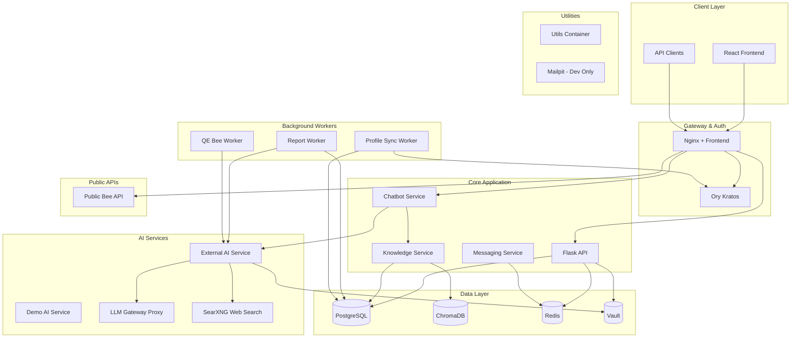
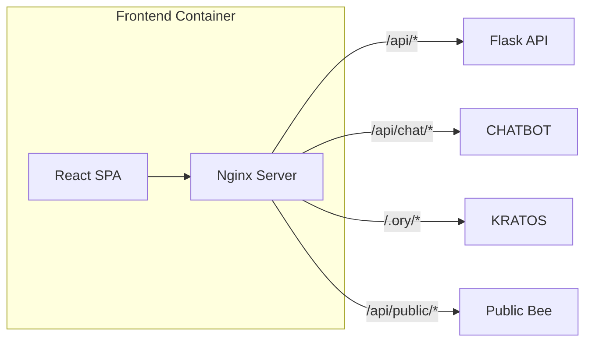
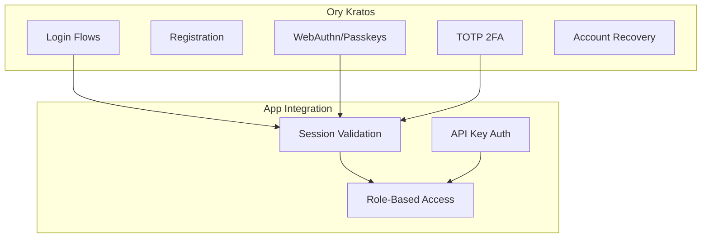
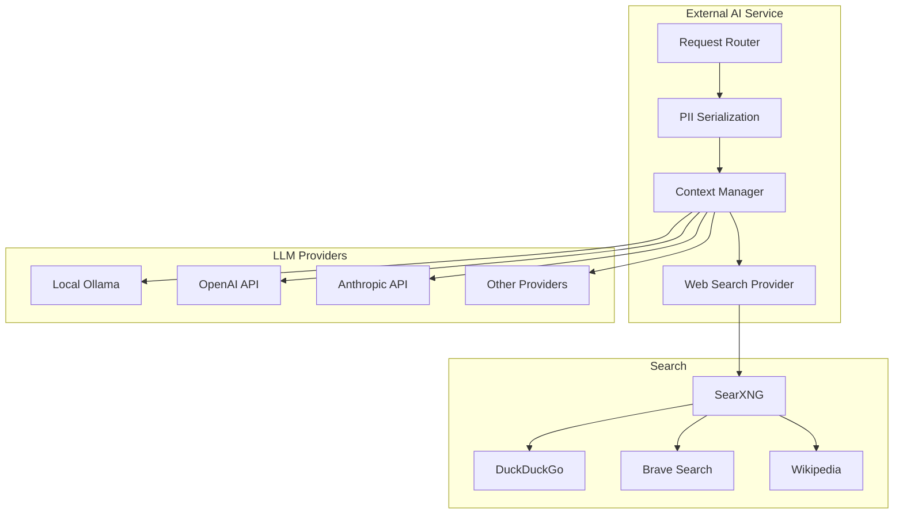
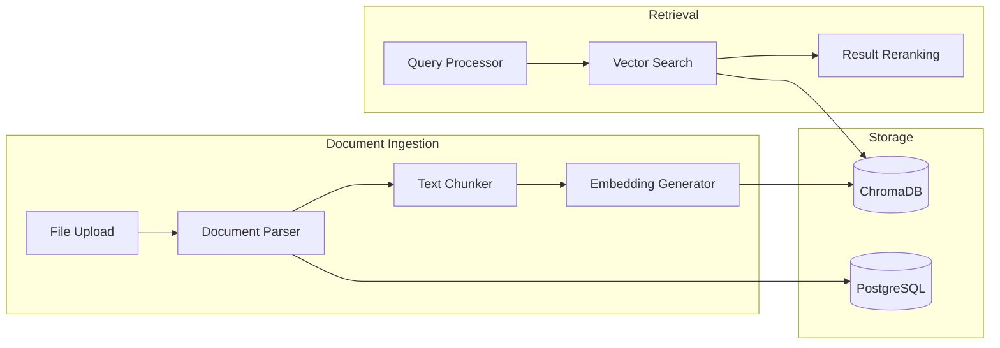
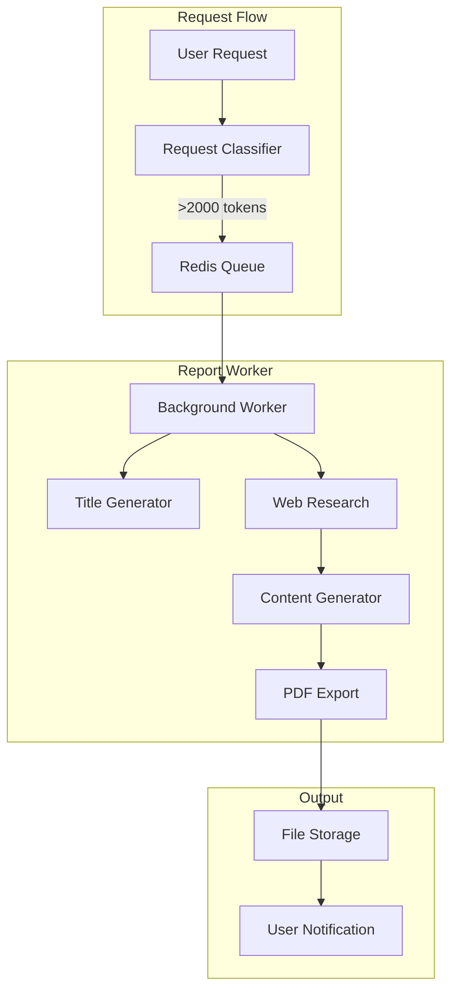

# STING-CE System Architecture

## Executive Summary

STING-CE is a modern, AI-powered platform that manages "Honey Jars"—containerized knowledge bases that organizations can create, share, and query. Built with a microservices architecture, it combines intelligent knowledge management with AI capabilities to provide semantic search, automated content analysis, and AI-powered report generation.

## System Overview



## Service Inventory

### Core Services (Always Running)

| Service | Container | Port | Purpose |
|---------|-----------|------|---------|
| **Frontend** | `sting-ce-frontend` | 443 | React SPA + Nginx reverse proxy |
| **App** | `sting-ce-app` | 5000 | Flask API - core business logic |
| **Chatbot** | `sting-ce-chatbot` | 8001 | Bee chat interface coordination |
| **Knowledge** | `sting-ce-knowledge` | 8002 | Document processing & RAG |
| **Messaging** | `sting-ce-messaging` | 8003 | Inter-service messaging |
| **External AI** | `sting-ce-external-ai` | 8004 | AI orchestration & web search |
| **Kratos** | `sting-ce-kratos` | 4433/4434 | Identity & auth management |

### AI & Search Services

| Service | Container | Port | Purpose |
|---------|-----------|------|---------|
| **LLM Gateway** | `sting-ce-llm-gateway-proxy` | 11434 | Nginx proxy to Ollama models |
| **SearXNG** | `sting-ce-searxng` | 8080 | Self-hosted meta-search engine |
| **Demo AI** | `sting-ce-demo-ai` | 8005 | Demo/fallback AI responses |

### Background Workers

| Service | Container | Purpose |
|---------|-----------|---------|
| **Report Worker** | `sting-ce-report-worker` | Async report generation |
| **QE Bee Worker** | `sting-ce-qe-bee-worker` | Quality assurance validation |
| **Profile Sync** | `sting-ce-profile-sync-worker` | Kratos ↔ App user sync |

### Data Services

| Service | Container | Port | Purpose |
|---------|-----------|------|---------|
| **PostgreSQL** | `sting-ce-db` | 5432 | Primary relational database |
| **ChromaDB** | `sting-ce-chroma` | 8000 | Vector embeddings database |
| **Redis** | `sting-ce-redis` | 6379 | Cache, sessions, job queues |
| **Vault** | `sting-ce-vault` | 8200 | Secrets & PII encryption |

### Public APIs

| Service | Container | Port | Purpose |
|---------|-----------|------|---------|
| **Public Bee** | `sting-ce-public-bee` | 8006 | External chatbot API |

### Utilities & Development

| Service | Container | Purpose |
|---------|-----------|---------|
| **Utils** | `sting-ce-utils` | Helper scripts, health checks |
| **Mailpit** | `sting-ce-mailpit` | Email testing (dev profile only) |

---

## Detailed Component Architecture

### 1. Frontend & Gateway Layer



- **React SPA**: Material-UI based interface
- **Nginx**: Reverse proxy, SSL termination, static file serving
- **Routing**: Path-based routing to backend services

### 2. Authentication Layer



- **Ory Kratos**: Self-hosted identity management
- **Authentication Methods**: Password, Passkeys (WebAuthn), TOTP
- **Session Management**: Cookie-based with Redis backing
- **API Keys**: For programmatic access

### 3. AI Service Architecture



- **External AI Service**: Central AI orchestration
- **Provider Support**: Local (Ollama) + External (OpenAI, Anthropic, etc.)
- **PII Protection**: Automatic detection and Vault-based encryption
- **Web Search**: SearXNG meta-search for real-time context

### 4. Knowledge & RAG Pipeline



- **Supported Formats**: PDF, DOCX, TXT, Markdown, HTML
- **Chunking**: Intelligent text splitting with overlap
- **Embeddings**: Local or API-based embedding generation
- **Vector Search**: Semantic similarity via ChromaDB

### 5. Report Generation Pipeline



- **Classification**: Automatic chat vs. report detection
- **Async Processing**: Redis-backed job queue
- **Web Research**: SearXNG integration for current info
- **Export**: Professional PDF with STING branding

---

## Data Flow

### Chat Message Flow

```
User → Frontend → Nginx → Chatbot → External AI → LLM Gateway → Ollama
                                  ↓
                            Knowledge Service → ChromaDB (RAG)
                                  ↓
                            SearXNG (Web Search)
                                  ↓
                            Vault (PII Handling)
```

### Report Generation Flow

```
User Request → Flask API → Request Classifier
                              ↓
                        [>2000 tokens?]
                              ↓ Yes
                        Redis Queue → Report Worker
                                          ↓
                                    External AI (generation)
                                          ↓
                                    PDF Generator
                                          ↓
                                    File Storage → User Download
```

---

## Network Architecture

### Internal Docker Network

All services communicate on the `sting-network` Docker bridge network.

```
┌─────────────────────────────────────────────────────────────────┐
│                      sting-network                               │
│                                                                  │
│  ┌──────────┐  ┌──────────┐  ┌──────────┐  ┌──────────┐        │
│  │ frontend │  │   app    │  │ chatbot  │  │knowledge │        │
│  │  :443    │  │  :5000   │  │  :8001   │  │  :8002   │        │
│  └──────────┘  └──────────┘  └──────────┘  └──────────┘        │
│                                                                  │
│  ┌──────────┐  ┌──────────┐  ┌──────────┐  ┌──────────┐        │
│  │external- │  │ searxng  │  │llm-gate- │  │  vault   │        │
│  │   ai     │  │  :8080   │  │way-proxy │  │  :8200   │        │
│  │  :8004   │  │          │  │ :11434   │  │          │        │
│  └──────────┘  └──────────┘  └──────────┘  └──────────┘        │
│                                                                  │
│  ┌──────────┐  ┌──────────┐  ┌──────────┐  ┌──────────┐        │
│  │   db     │  │  chroma  │  │  redis   │  │  kratos  │        │
│  │  :5432   │  │  :8000   │  │  :6379   │  │:4433/4434│        │
│  └──────────┘  └──────────┘  └──────────┘  └──────────┘        │
└─────────────────────────────────────────────────────────────────┘
```

### External Access

| Port | Service | Purpose |
|------|---------|---------|
| 443 | Frontend/Nginx | HTTPS web access |
| 5050 | Flask API | Direct API access (dev) |
| 8200 | Vault | Secrets management UI |

---

## Optional Components

### Observability Stack (docker-compose.full.yml)

For production deployments, enable the Beeacon observability stack:

| Service | Purpose |
|---------|---------|
| **Grafana** | Dashboards and visualization |
| **Loki** | Log aggregation |
| **Promtail** | Log collection |
| **Pollen Filter** | PII sanitization in logs |

### Development Tools

| Service | Profile | Purpose |
|---------|---------|---------|
| **Mailpit** | `dev`, `development` | Email testing |

---

## Key Architectural Principles

### 1. Local-First AI
- All AI processing can run locally via Ollama
- No mandatory external API dependencies
- Optional external LLM providers for enhanced capabilities

### 2. Privacy by Design
- PII detection and Vault-based encryption
- Self-hosted search (SearXNG)
- No telemetry or data exfiltration

### 3. Microservices with Boundaries
- Clear service responsibilities
- API-based communication
- Independent scaling and deployment

### 4. Async Processing
- Background workers for long-running tasks
- Redis-backed job queues
- Non-blocking user experience

### 5. Security Layers
- Ory Kratos for identity management
- HashiCorp Vault for secrets
- WebAuthn/Passkey support for passwordless auth

---

## Technology Stack

### Languages & Frameworks
- **Frontend**: React 18, Material-UI, Redux Toolkit
- **Backend**: Python 3.11+, Flask, FastAPI
- **Workers**: Python with Redis RQ

### Databases
- **PostgreSQL 16**: Primary relational data
- **ChromaDB**: Vector embeddings
- **Redis 7**: Caching, sessions, queues

### AI/ML
- **Ollama**: Local LLM inference
- **LangChain**: AI orchestration
- **SearXNG**: Meta-search aggregation

### Infrastructure
- **Docker**: Container runtime
- **Nginx**: Reverse proxy, static serving
- **Ory Kratos**: Identity management
- **HashiCorp Vault**: Secrets management

---

*Last updated: January 2026*
