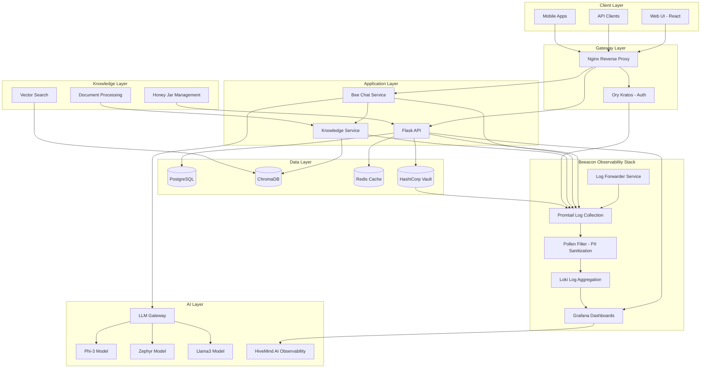

# STING-CE System Architecture

## Executive Summary
STING-CE is a modern, AI-powered platform that manages "Honey Pots"—containerized knowledge bases that organizations can create, share, and monetize. Built with a microservices architecture, it combines intelligent knowledge management with AI capabilities to provide semantic search, automated content analysis, and collaborative knowledge sharing. The platform also supports traditional cybersecurity honey jars for threat detection and analysis.

## System Overview

## Core Components

### 1. Client Layer
- **Web UI**: React-based SPA with Material-UI.
- **API Clients**: RESTful API consumers.
- **Mobile Apps**: Future - React Native.

### 2. Gateway Layer
- **Nginx**: Reverse proxy, SSL termination, load balancing.
- **Ory Kratos**: Identity and access management, passkey support.

### 3. Application Layer
- **Flask API**: Core business logic, honey jar management.
- **Bee Chat**: AI-powered chat interface with context awareness.
- **Knowledge Service**: Document processing and vector search.

### 4. Beeacon Observability Stack
- **Grafana**: Interactive dashboards and monitoring visualization.
- **Loki**: Centralized log aggregation and storage.
- **Promtail**: Log collection agent with health check dependencies.
- **Log Forwarder**: Cross-platform container log streaming service.
- **Pollen Filter**: PII sanitization and Vault-aware log processing.
- **HiveMind AI**: Future AI-powered observability and anomaly detection.

### 5. AI Layer
- **LLM Gateway**: Model routing and management.
- **Multiple Models**: Phi-3, Zephyr, Llama3 for different use cases.
- **On-premise**: All AI processing happens locally.
- **HiveMind Integration**: AI-powered monitoring and observability.

### 6. Data Layer
- **PostgreSQL**: Primary data store for structured data.
- **ChromaDB**: Vector database for AI embeddings.
- **Redis**: Session cache and real-time data.
- **Vault**: Secrets management and encryption keys.

### 7. Knowledge Layer
- **Honey Jar Management**: Create, organize, and share knowledge bases.
- **Document Processing**: Multi-format ingestion (PDF, DOCX, Markdown, etc.)
- **Vector Search**: AI-powered semantic search and retrieval.

## Key Architectural Principles

### 1. Microservices Architecture
- **Loose Coupling**: Services communicate via APIs.
- **Independent Scaling**: Each service scales individually.
- **Technology Agnostic**: Services can use different tech stacks.

### 2. Security First
- **Zero Trust**: Every request is authenticated.
- **End-to-End Encryption**: TLS everywhere.
- **Secrets Management**: No hardcoded credentials.

### 3. AI-Native Design
- **Local Processing**: No external AI APIs.
- **Context Awareness**: AI understands system state.
- **Continuous Learning**: Models improve with usage.

### 4. Developer Experience
- **API-First**: Everything accessible via API.
- **Self-Documenting**: OpenAPI/Swagger specs.
- **Extensible**: Plugin architecture.

### 5. Observability First
- **Comprehensive Monitoring**: Real-time system health and performance metrics.
- **Centralized Logging**: All services feed into unified log aggregation.
- **PII Protection**: Automated sanitization of sensitive data in logs.
- **Cross-Platform Support**: Works across macOS Docker Desktop and Linux environments.

## Communication Patterns

### Synchronous Communication
- REST APIs for CRUD operations
- GraphQL for complex queries (future)
- WebSocket for real-time updates.

### Asynchronous Communication
- Event-driven architecture for honey jar events
- Message queuing for background jobs
- Pub/sub for real-time notifications.

## Deployment Architecture

### Container-Based
- Docker containers for all services
- Docker Compose for local development
- Kubernetes ready for production.

### Cloud-Native
- Stateless services (except data layer)
- Horizontal scaling capability
- Cloud-agnostic design.

## Non-Functional Requirements

### Performance
- < 100ms API response time (p95)
- < 2s AI response time
- Support 1000+ concurrent users.

### Availability
- 99.9% uptime target
- Graceful degradation
- Automatic failover.

### Security
- SOC 2 compliance ready
- GDPR compliant
- Regular security audits.

### Scalability
- Horizontal scaling for all services
- Auto-scaling based on load
- Multi-region deployment capable.

## Technology Stack

### Frontend
- React 18+
- Material-UI v5
- Redux Toolkit
- React Router v6.

### Backend
- Python 3.11+
- Flask 2.3+
- FastAPI 0.104+
- SQLAlchemy 2.0+.

### AI/ML
- PyTorch 2.0+
- Transformers 4.30+
- LangChain 0.1+
- ChromaDB 0.4+.

### Infrastructure
- Docker 24+
- PostgreSQL 16
- Redis 7+
- Nginx 1.25+.

## Key Capabilities

### Core Platform
- Honey jar management and organization
- AI integration for intelligent knowledge processing
- Local deployment support
- Multi-tenant capable architecture.

### Observability
- Beeacon Observability Stack with centralized logging
- Real-time monitoring dashboards
- PII sanitization pipeline
- Comprehensive system health tracking.

---

*This document provides a high-level overview of STING-CE's system architecture. For detailed component documentation, see the individual component guides.*