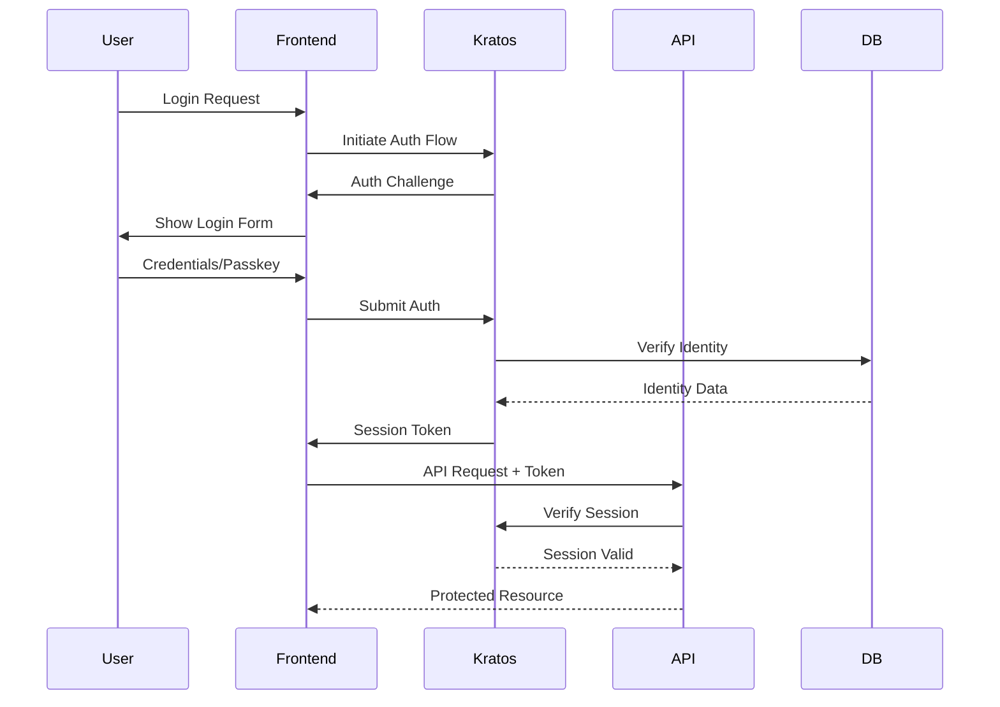
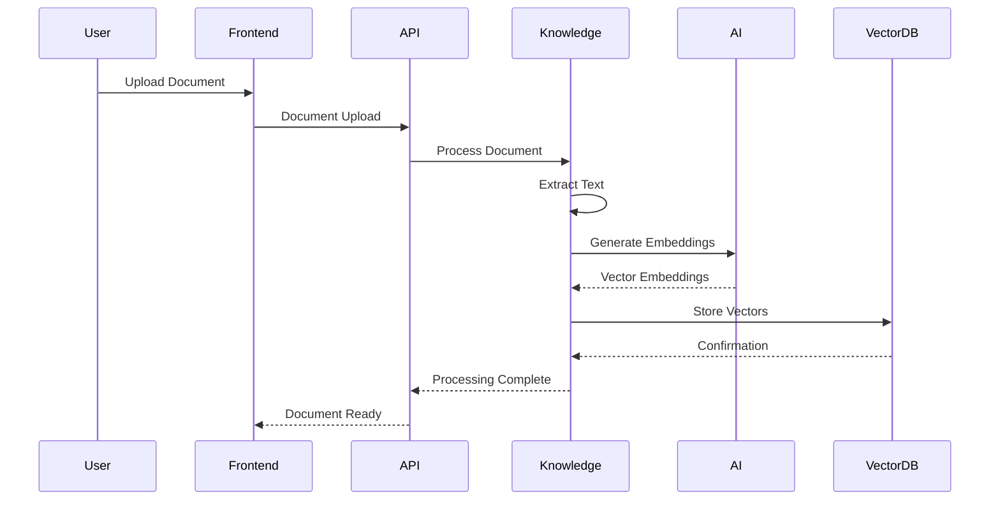
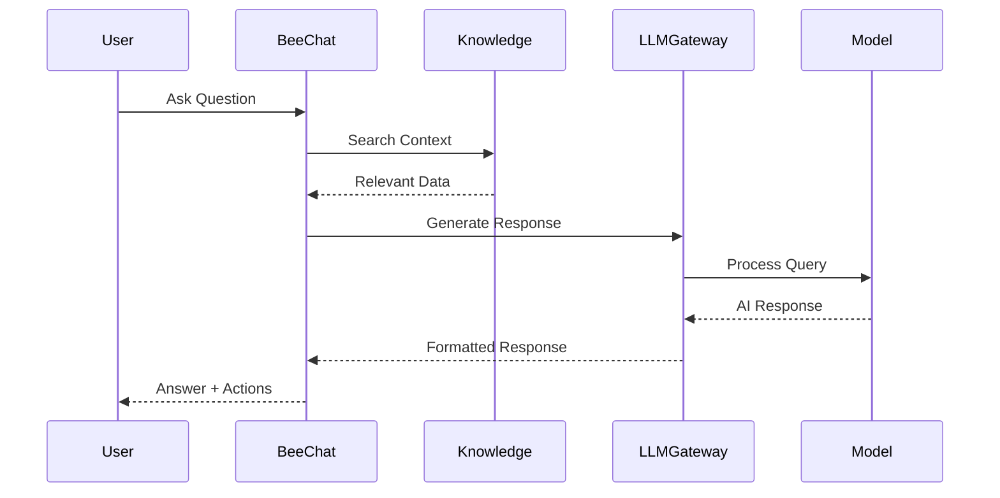
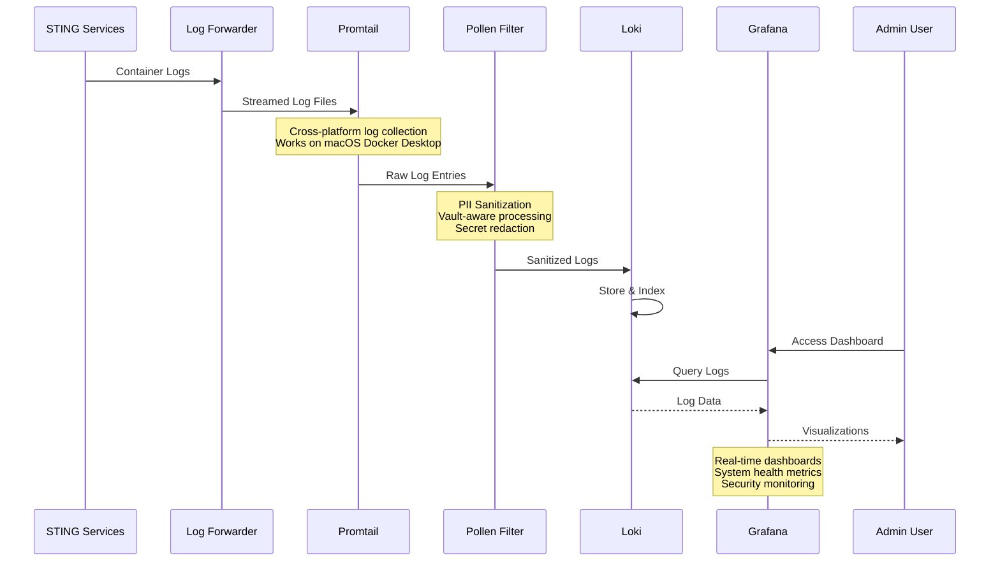
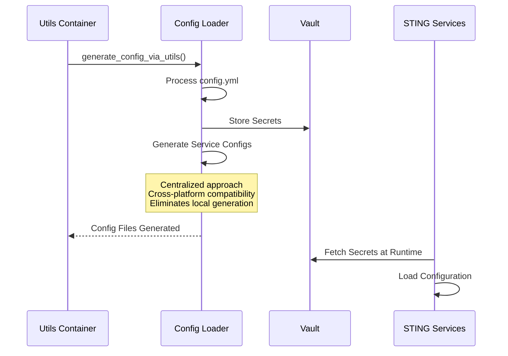

# STING-CE Technical Architecture

## Overview
This document provides detailed technical implementation details for STING-CE, including service definitions, data flows, and integration patterns.

## Service Architecture

### Service Definitions

```yaml
# Service Registry
services:
  frontend:
    type: SPA
    port: 8443
    technology: React
    dependencies: [api, kratos]
    
  api:
    type: REST
    port: 5050
    technology: Flask
    dependencies: [db, redis, vault]
    
  bee:
    type: WebSocket/REST
    port: 8888
    technology: FastAPI
    dependencies: [knowledge, llm-gateway, kratos]
    
  knowledge:
    type: REST
    port: 8090
    technology: FastAPI
    dependencies: [chroma]
    
  llm-gateway:
    type: REST/gRPC
    port: 8086
    technology: FastAPI
    dependencies: []
    
  kratos:
    type: REST
    port: 4433/4434
    technology: Go
    dependencies: [db]
    
  # Beeacon Observability Stack
  loki:
    type: REST
    port: 3100
    technology: Grafana Loki
    dependencies: []
    
  promtail:
    type: Agent
    port: 9080
    technology: Grafana Promtail
    dependencies: [loki, log-forwarder]
    
  grafana:
    type: Web UI/REST
    port: 3000
    technology: Grafana
    dependencies: [loki, vault]
    
  log-forwarder:
    type: Service
    port: N/A
    technology: Alpine Linux + Docker CLI
    dependencies: [docker.sock]
    
  chatbot:
    type: WebSocket/REST
    port: 8081
    technology: FastAPI
    dependencies: [messaging, llm-gateway, kratos]
```

## Data Flow Architecture

### 1. Authentication Flow



### 2. Document Processing Flow



### 3. AI Chat Flow



### 4. Beeacon Observability Flow



### 5. Configuration Management Flow



## API Architecture

### RESTful Design Principles

```python
# Resource-based URLs
GET    /api/v1/honey-pots           # List honey pots
POST   /api/v1/honey-pots           # Create honey pot
GET    /api/v1/honey-pots/{id}      # Get honey pot
PUT    /api/v1/honey-pots/{id}      # Update honey pot
DELETE /api/v1/honey-pots/{id}      # Delete honey pot

# Nested Resources
GET    /api/v1/honey-pots/{id}/documents
GET    /api/v1/honey-pots/{id}/search
POST   /api/v1/honey-pots/{id}/upload

# Search and Filtering
GET    /api/v1/documents?type=pdf&honey_jar={id}&from=2024-01-01
GET    /api/v1/search?q=installation&scope=honey_jar

# Beeacon Observability APIs
GET    /api/beeacon/status                    # System health overview
GET    /api/beeacon/pollen-filter/stats      # PII sanitization metrics
GET    /api/beeacon/grafana/status           # Grafana availability
GET    /api/beeacon/loki/status              # Loki log aggregation status
GET    /api/beeacon/alerts                   # System alerts
POST   /api/beeacon/health-report            # Generate health report
GET    /api/beeacon/config                   # Observability configuration (admin)
```

### API Gateway Pattern

```nginx
# nginx.conf snippet
upstream api_backend {
    server app:5050;
}

upstream bee_backend {
    server chatbot:8888;
}

upstream llm_backend {
    server llm-gateway:8086;
}

location /api/ {
    proxy_pass http://api_backend;
    proxy_set_header X-Real-IP $remote_addr;
    proxy_set_header X-Forwarded-For $proxy_add_x_forwarded_for;
}

location /api/bee/ {
    proxy_pass http://bee_backend/;
    proxy_http_version 1.1;
    proxy_set_header Upgrade $http_upgrade;
    proxy_set_header Connection "upgrade";
}
```

## Database Architecture

### Schema Design

```sql
-- Core Tables
CREATE TABLE users (
    id UUID PRIMARY KEY,
    email VARCHAR(255) UNIQUE NOT NULL,
    role VARCHAR(50) NOT NULL,
    created_at TIMESTAMP DEFAULT NOW()
);

CREATE TABLE honey_jars (
    id UUID PRIMARY KEY,
    name VARCHAR(255) NOT NULL,
    type VARCHAR(50) NOT NULL,
    config JSONB NOT NULL,
    status VARCHAR(50) NOT NULL,
    owner_id UUID REFERENCES users(id),
    created_at TIMESTAMP DEFAULT NOW()
);

CREATE TABLE documents (
    id UUID PRIMARY KEY,
    honey_jar_id UUID REFERENCES honey_jars(id),
    title VARCHAR(500) NOT NULL,
    file_type VARCHAR(50) NOT NULL,
    content_hash VARCHAR(64),
    processing_status VARCHAR(50),
    chunk_count INTEGER DEFAULT 0,
    created_at TIMESTAMP DEFAULT NOW()
);

-- Indexes for Performance
CREATE INDEX idx_docs_honey_jar_time ON documents(honey_jar_id, created_at DESC);
CREATE INDEX idx_docs_file_type ON documents(file_type);
CREATE INDEX idx_docs_processing_status ON documents(processing_status) WHERE processing_status = 'pending';
```

### Vector Database Schema

```python
# ChromaDB Collections
collections = {
    "honey_jar_documents": {
        "embedding_function": "sentence-transformers",
        "metadata_fields": ["honey_jar_id", "document_type", "timestamp"],
        "distance_metric": "cosine"
    },
    "knowledge_base": {
        "embedding_function": "all-minilm",
        "metadata_fields": ["source", "category", "tags"],
        "distance_metric": "cosine"
    },
    "documentation": {
        "embedding_function": "all-minilm",
        "metadata_fields": ["doc_type", "version", "tags"],
        "distance_metric": "cosine"
    }
}
```

## Microservices Communication

### Service Mesh Architecture

```yaml
# Service Communication Matrix
communication:
  frontend:
    sync: [api, kratos]
    async: []
    
  api:
    sync: [db, redis, vault, kratos]
    async: [event-queue]
    
  bee:
    sync: [knowledge, llm-gateway, kratos]
    async: [notification-queue]
    
  knowledge:
    sync: [chroma]
    async: []
    
  # Observability Services
  loki:
    sync: []
    async: [log-stream]
    
  promtail:
    sync: [loki]
    async: [log-collection]
    
  grafana:
    sync: [loki, vault]
    async: []
    
  log-forwarder:
    sync: [docker-socket]
    async: [log-streaming]
    
  honey jars:
    sync: []
    async: [event-stream]
```

### Event-Driven Architecture

```python
# Event Types
class EventType(Enum):
    HoneyJar_TRIGGERED = "honey jar.triggered"
    THREAT_DETECTED = "threat.detected"
    USER_ACTION = "user.action"
    SYSTEM_ALERT = "system.alert"
    AI_ANALYSIS_COMPLETE = "ai.analysis.complete"
    # Observability Events
    LOG_SANITIZED = "observability.log.sanitized"
    HEALTH_CHECK_FAILED = "observability.health.failed"
    DASHBOARD_ACCESSED = "observability.dashboard.accessed"
    ALERT_TRIGGERED = "observability.alert.triggered"
    PII_DETECTED = "observability.pii.detected"

# Event Schema
class Event(BaseModel):
    id: str = Field(default_factory=lambda: str(uuid4()))
    type: EventType
    timestamp: datetime = Field(default_factory=datetime.utcnow)
    source: str
    payload: Dict[str, Any]
    metadata: Dict[str, Any] = {}
    correlation_id: Optional[str] = None
```

## Security Architecture

### Defense in Depth

```yaml
security_layers:
  network:
    - firewall_rules
    - ddos_protection
    - intrusion_detection
    
  application:
    - authentication: "Ory Kratos"
    - authorization: "RBAC + ABAC"
    - input_validation: "Strict schemas"
    - output_encoding: "Context-aware"
    
  data:
    - encryption_at_rest: "AES-256"
    - encryption_in_transit: "TLS 1.3"
    - key_management: "HashiCorp Vault"
    
  monitoring:
    - audit_logging: "All actions"
    - anomaly_detection: "ML-based"
    - incident_response: "Automated"
```

### Zero Trust Implementation

```python
# Every request is verified
@app.before_request
def verify_request():
    # Verify authentication
    session = verify_kratos_session(request.headers.get('Authorization'))
    if not session:
        abort(401)
    
    # Verify authorization
    if not check_permissions(session.identity, request.endpoint):
        abort(403)
    
    # Rate limiting
    if not check_rate_limit(session.identity):
        abort(429)
    
    # Audit logging
    audit_log(session.identity, request)
```

## Performance Optimization

### Caching Strategy

```python
# Multi-level caching
cache_layers = {
    "L1": {
        "type": "in-memory",
        "ttl": 60,  # seconds
        "size": "100MB"
    },
    "L2": {
        "type": "redis",
        "ttl": 3600,  # 1 hour
        "size": "1GB"
    },
    "L3": {
        "type": "cdn",
        "ttl": 86400,  # 1 day
        "size": "unlimited"
    }
}

# Cache key patterns
cache_keys = {
    "user_session": "session:{user_id}",
    "honey jar_stats": "stats:honey jar:{id}:{period}",
    "ai_response": "ai:response:{query_hash}",
    "threat_intel": "intel:{category}:{date}"
}
```

### Database Optimization

```sql
-- Partitioning for large tables
CREATE TABLE events_2024_01 PARTITION OF events
    FOR VALUES FROM ('2024-01-01') TO ('2024-02-01');

-- Materialized views for analytics
CREATE MATERIALIZED VIEW daily_threat_summary AS
SELECT 
    date_trunc('day', created_at) as day,
    honey jar_id,
    event_type,
    COUNT(*) as event_count,
    COUNT(DISTINCT source_ip) as unique_sources
FROM events
GROUP BY 1, 2, 3;

-- Refresh strategy
REFRESH MATERIALIZED VIEW CONCURRENTLY daily_threat_summary;
```

## Monitoring and Observability

### Metrics Collection

```yaml
metrics:
  application:
    - request_rate
    - response_time
    - error_rate
    - queue_depth
    
  business:
    - honey jars_active
    - events_per_minute
    - threats_detected
    - ai_queries_per_hour
    
  infrastructure:
    - cpu_usage
    - memory_usage
    - disk_io
    - network_throughput
    
  observability:
    - logs_processed_per_second
    - pii_patterns_detected
    - sanitization_rate
    - dashboard_queries_per_minute
    - alert_frequency
    - log_retention_usage
    - grafana_active_sessions
```

### Distributed Tracing

```python
# OpenTelemetry integration
from opentelemetry import trace

tracer = trace.get_tracer(__name__)

@tracer.start_as_current_span("process_honey jar_event")
def process_event(event: Event):
    span = trace.get_current_span()
    span.set_attribute("event.type", event.type)
    span.set_attribute("event.source", event.source)
    
    # Process event
    with tracer.start_as_current_span("analyze_threat"):
        threat_analysis = analyze_threat(event)
    
    with tracer.start_as_current_span("store_event"):
        store_event(event, threat_analysis)
    
    return threat_analysis
```

## Development Practices

### API Versioning

```python
# URL versioning
/api/v1/honey jars
/api/v2/honey jars  # Breaking changes

# Header versioning (alternative)
Accept: application/vnd.sting.v2+json

# Response includes version
{
    "api_version": "2.0",
    "data": {...}
}
```

### Error Handling

```python
# Consistent error responses
class APIError(Exception):
    def __init__(self, code: str, message: str, status: int = 400):
        self.code = code
        self.message = message
        self.status = status

@app.errorhandler(APIError)
def handle_api_error(error):
    return jsonify({
        "error": {
            "code": error.code,
            "message": error.message,
            "timestamp": datetime.utcnow().isoformat(),
            "request_id": g.request_id
        }
    }), error.status
```

---

*This technical architecture document provides implementation details for STING-CE. For specific component details, refer to the component documentation.*