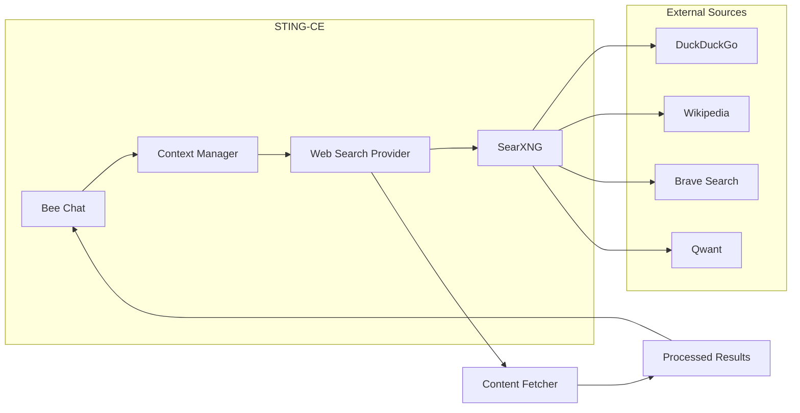

# Web Search Integration

STING-CE includes **SearXNG**, a self-hosted meta-search engine that provides Bee with real-time web search capabilities while maintaining privacy and avoiding external API dependencies.

## Overview

When enabled, Bee can search the web to find current information, research topics, and gather context that may not be in your Honey Jars. This is particularly useful for:

- **Current events** - Information that changes frequently
- **Technical documentation** - Latest framework versions, API changes
- **Research topics** - Broader context beyond your knowledge base
- **Report generation** - Enriching reports with external sources

## Architecture



### How It Works

1. **Query Sanitization** - User queries are sanitized to remove PII (emails, IPs, API keys, SSNs, credit cards) before searching
2. **Meta-Search** - SearXNG aggregates results from multiple privacy-respecting search engines
3. **Content Fetching** - Optionally fetches and extracts content from result URLs
4. **Context Scaling** - Automatically adjusts content size based on the LLM's context window
5. **Response Enhancement** - Web context is added to Bee's prompt for more informed responses

## Configuration

### Environment Variables

| Variable | Default | Description |
|----------|---------|-------------|
| `WEB_SEARCH_ENABLED` | `false` | Enable/disable web search |
| `WEB_SEARCH_PROVIDER` | `searxng` | Search provider (`searxng`, `serper`, `brave`, `tavily`) |
| `SEARXNG_URL` | `http://searxng:8080` | SearXNG service URL |
| `WEB_SEARCH_TIMEOUT` | `5` | Per-request timeout (seconds) |
| `WEB_SEARCH_TOTAL_TIMEOUT` | `15` | Total operation timeout (seconds) |
| `WEB_SEARCH_FETCH_CONTENT` | `true` | Fetch full page content from URLs |
| `WEB_SEARCH_MAX_RESULTS` | `3` | Maximum search results to return |
| `WEB_SEARCH_MAX_CONTENT_LENGTH` | `2000` | Max characters per source |
| `WEB_SEARCH_API_KEY` | *(empty)* | API key for external providers (not needed for SearXNG) |

### Enabling Web Search

To enable web search, set in your environment file:

```bash
WEB_SEARCH_ENABLED=true
WEB_SEARCH_PROVIDER=searxng
```

Or via `manage_sting.sh`:

```bash
./manage_sting.sh config set WEB_SEARCH_ENABLED true
./manage_sting.sh restart external-ai
```

## SearXNG Configuration

The SearXNG configuration is stored in `searxng/settings.yml`. Default settings are optimized for STING-CE:

### Enabled Search Engines

| Engine | Weight | Notes |
|--------|--------|-------|
| **DuckDuckGo** | 1.5 | Primary - no tracking |
| **Wikipedia** | 1.2 | Factual information |
| **Brave Search** | 1.0 | Privacy-focused |
| **Qwant** | 0.8 | European privacy search |
| **Bing** | 0.5 | Fallback for coverage |

### Security Settings

```yaml
server:
  limiter: false        # Disabled for internal service use
  public_instance: false # Not exposed publicly
  image_proxy: false     # Text-only results
```

## Context-Aware Scaling

Web search automatically scales content fetching based on your LLM's context window:

| Context Tier | Max Tokens | Results | Content/Source | Total Budget |
|--------------|------------|---------|----------------|--------------|
| **Small** | < 8K | 2 | 1,000 chars | 2,000 chars |
| **Medium** | 8K - 32K | 3 | 2,000 chars | 5,000 chars |
| **Large** | 32K - 128K | 5 | 4,000 chars | 15,000 chars |
| **Huge** | > 128K | 5 | 8,000 chars | 30,000 chars |

This ensures web search doesn't overwhelm smaller models while taking full advantage of larger context windows.

## Privacy Features

### Query Sanitization

Before any query is sent to search engines, STING automatically removes:

- **Email addresses** - `user@example.com`
- **IP addresses** - `192.168.1.1`
- **API keys** - `sk-...`, `api_key:...`
- **Social Security Numbers** - `123-45-6789`
- **Credit card numbers** - `4111-1111-1111-1111`

### Blocked Domains

Content is not fetched from these domains (paywalls, login walls):

- `linkedin.com`, `facebook.com`, `twitter.com`, `x.com`
- `instagram.com`, `tiktok.com`, `youtube.com`

### Self-Hosted Advantage

Unlike external search APIs:

- ✅ **No API keys required**
- ✅ **No rate limits** (you control the infrastructure)
- ✅ **No query logging** by third parties
- ✅ **Full control** over which engines are used
- ✅ **Offline capable** (if engines are cached)

## External Provider Fallback

If SearXNG is unavailable or you prefer external APIs, STING supports:

| Provider | API Key Env Var | Notes |
|----------|-----------------|-------|
| **Serper** | `WEB_SEARCH_API_KEY` | Google results via API |
| **Brave** | `WEB_SEARCH_API_KEY` | Brave Search API |
| **Tavily** | `WEB_SEARCH_API_KEY` | AI-optimized search API |

Configure with:

```bash
WEB_SEARCH_ENABLED=true
WEB_SEARCH_PROVIDER=serper
WEB_SEARCH_API_KEY=your-api-key
```

If the external provider fails or has no API key, STING automatically falls back to SearXNG.

## Troubleshooting

### Web Search Not Working

1. **Check if enabled:**
   ```bash
   docker exec sting-ce-external-ai env | grep WEB_SEARCH
   ```

2. **Test SearXNG directly:**
   ```bash
   curl -s "http://localhost:8080/search?q=test&format=json" | jq '.results[:2]'
   ```

3. **Check SearXNG logs:**
   ```bash
   docker logs sting-ce-searxng --tail 50
   ```

### Slow Search Results

- Reduce `WEB_SEARCH_MAX_RESULTS` to 2
- Disable content fetching: `WEB_SEARCH_FETCH_CONTENT=false`
- Lower timeout: `WEB_SEARCH_TIMEOUT=3`

### Search Returns Empty

- Verify SearXNG container is healthy: `docker ps | grep searxng`
- Check enabled engines in `searxng/settings.yml`
- Some engines may be rate-limited; try again after a few minutes

## Integration with Reports

When Bee generates reports, web search provides additional context:

1. **Topic Research** - Searches for current information on the report topic
2. **Source Citation** - Includes URLs for references
3. **Fact Checking** - Cross-references claims with web sources

Web search can be skipped for internal operations (like title generation) to improve performance.

## Docker Compose Service

The SearXNG service is defined in `docker-compose.yml`:

```yaml
searxng:
  container_name: sting-ce-searxng
  image: searxng/searxng:latest
  environment:
    - SEARXNG_BASE_URL=http://searxng:8080
  volumes:
    - ./searxng:/etc/searxng:ro
  networks:
    sting-network:
      aliases:
        - searxng
  restart: unless-stopped
```

The service is only accessible from within the Docker network - it's not exposed to the host.

## Best Practices

1. **Enable for research-heavy use cases** - Reports, analysis, current events
2. **Disable for sensitive environments** - Air-gapped or compliance-restricted deployments
3. **Monitor usage** - Check logs if queries seem slow
4. **Update engines periodically** - Search engines change; update `settings.yml` if needed
5. **Use Honey Jars first** - Web search supplements but doesn't replace your knowledge base
